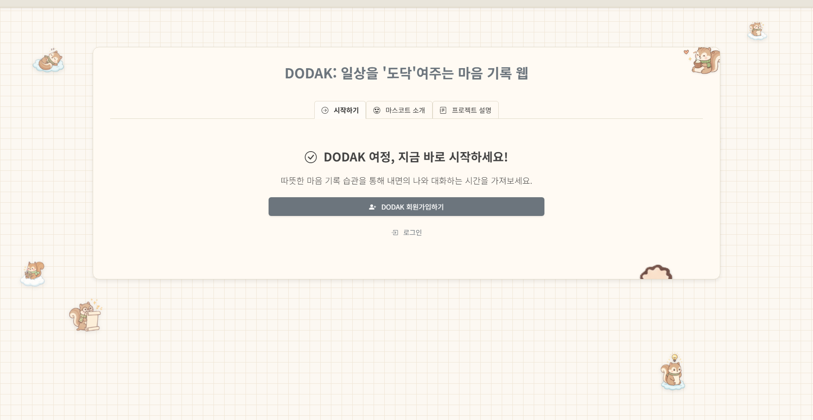
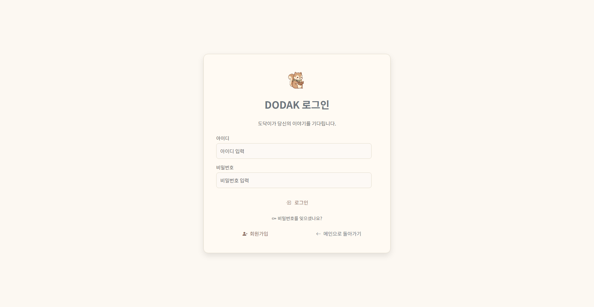
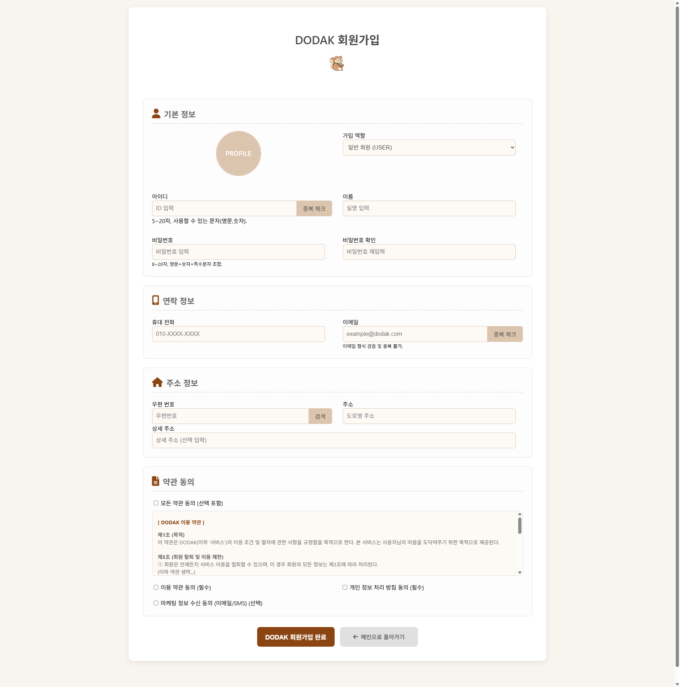
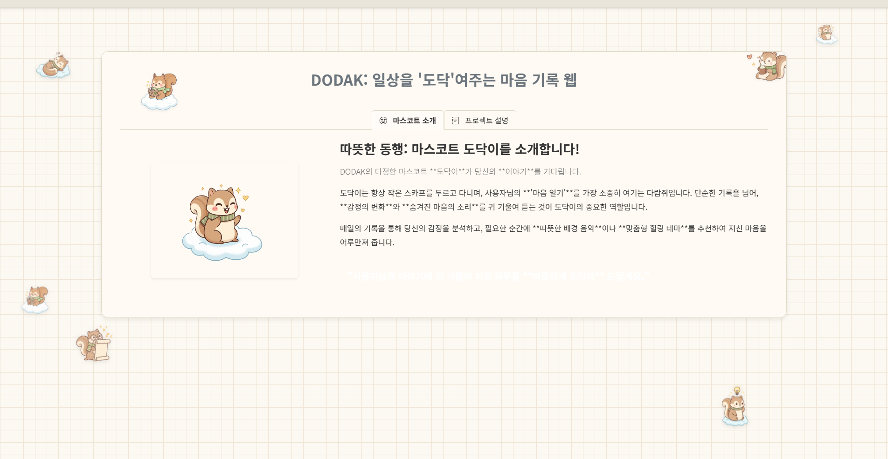
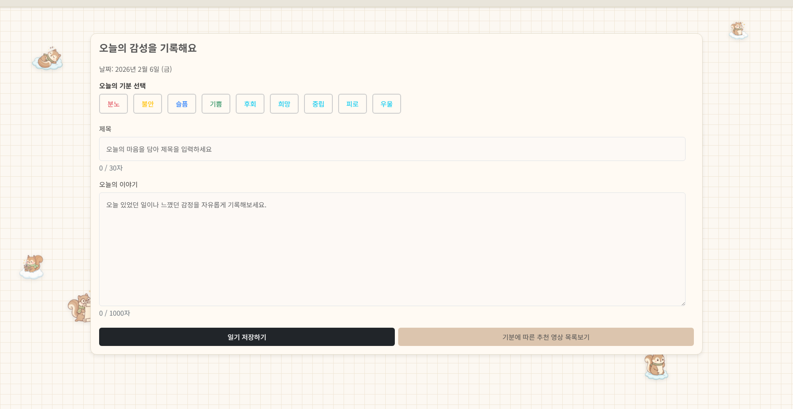
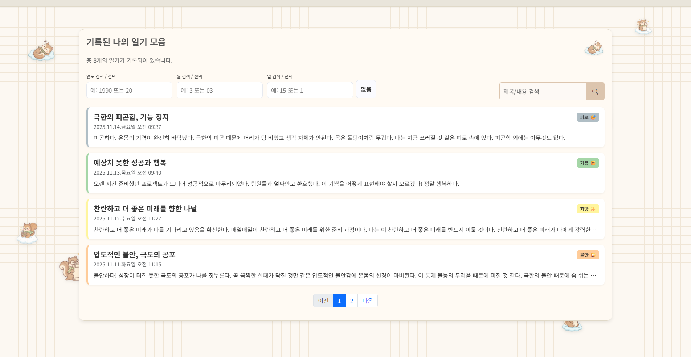
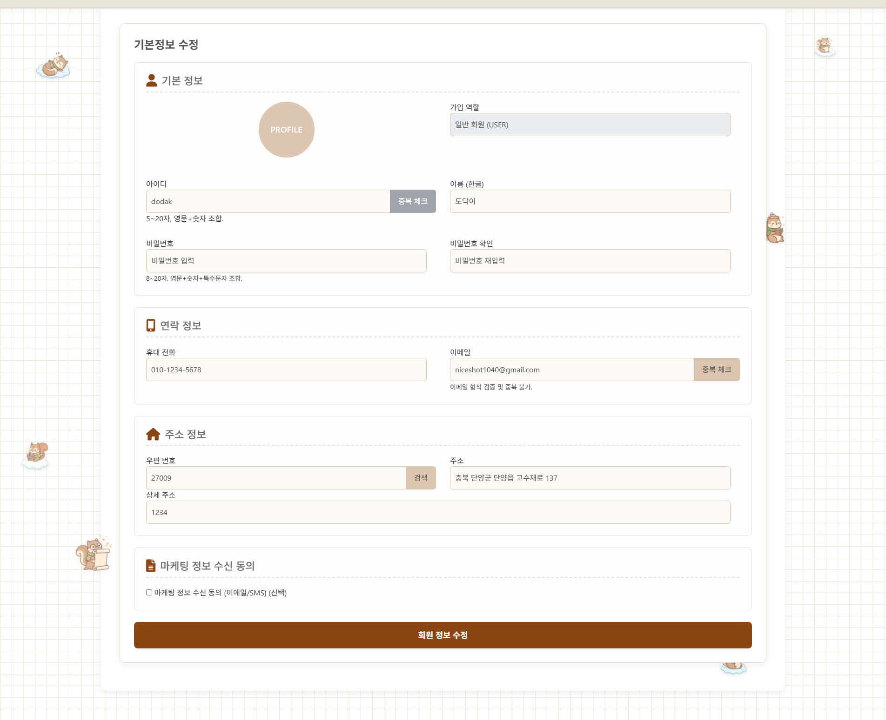
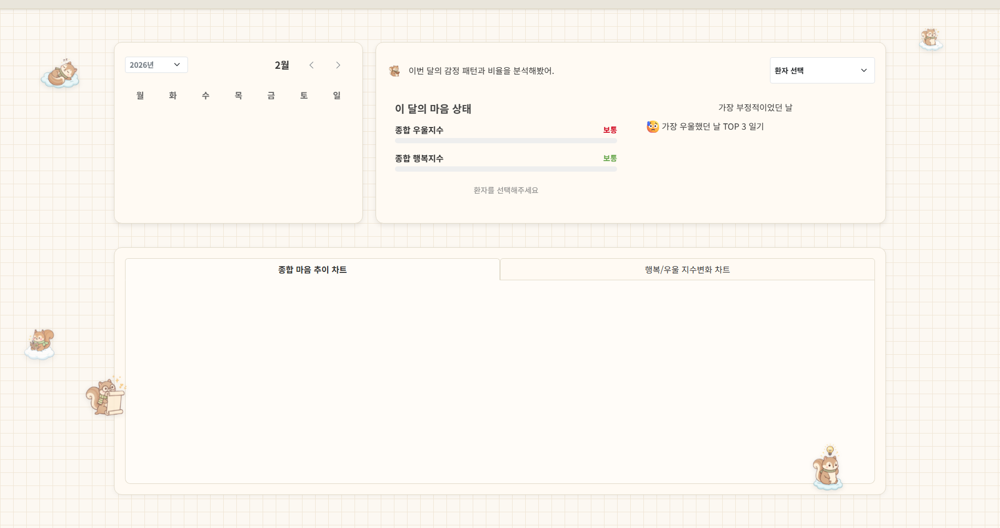
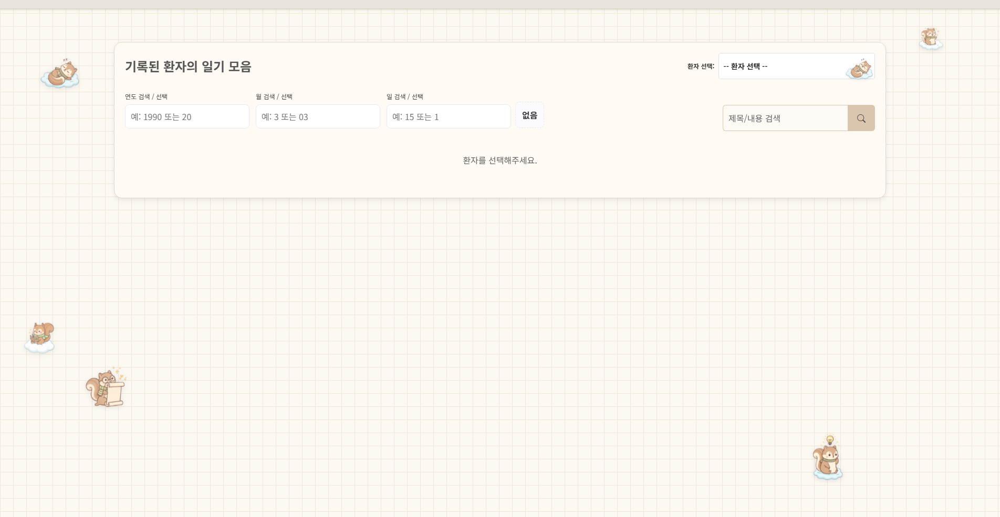
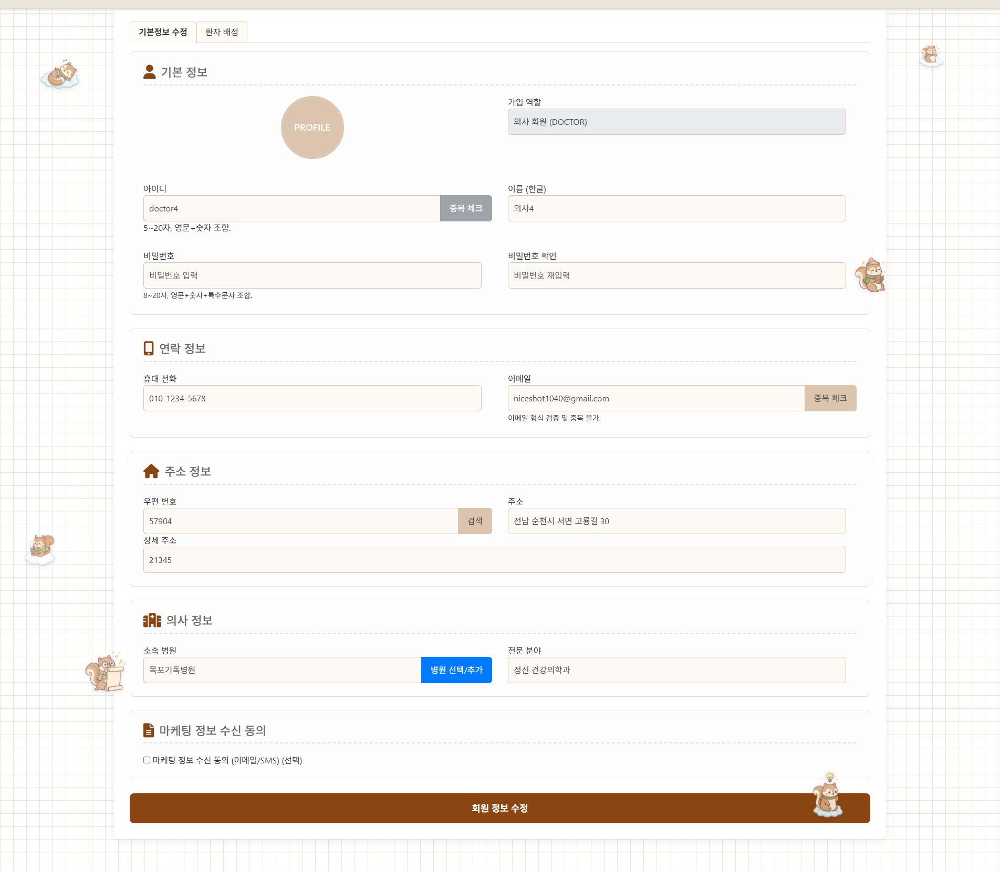

# DODAK(도닥) 프로젝트 최종 결과 보고서

---

## 문서 정보

| 항목 | 내용 |
|------|------|
| 프로젝트명 | DODAK - 일상을 '도닥'여주는 마음 기록 웹 |
| 문서 유형 | 최종 결과 보고서 |
| 작성일 | 2026-02-09 |
| 버전 | 1.1 |
| 개발 인원 | 6명 (최대영 PM/기획·프론트엔드, 박제연 기획·백엔드, 주현준 프론트엔드, 지태민 데이터베이스·테스트, 서유나 문서작성, 조민솔 문서작성) |

---

## 1. 프로젝트 개요

### 1.1 프로젝트 소개

**DODAK(도닥)**은 사용자의 일상 감정을 일기 형태로 기록하고, AI 기반으로 8가지 감정을 분석하여 심리적 건강을 지원하는 웹 서비스입니다. '도닥'이라는 이름은 사용자의 마음을 따뜻하게 '도닥여준다'는 의미를 담고 있으며, 마스코트 '도닥이'(다람쥐 캐릭터)가 사용자의 감정 여정을 함께합니다.

### 1.2 프로젝트 배경

현대인의 정신 건강 문제가 심각해지고 있습니다.

| 문제 | 설명 |
|------|------|
| 감정 방치 | 바쁜 일상 속 자신의 감정을 인식하지 못하고 방치하는 현대인 증가 |
| 심리 질환 증가 | 우울증, 불안장애 등 정신 건강 문제 지속적 증가 추세 |
| 상담 접근성 부족 | 높은 심리 상담 비용과 시간적 제약으로 인한 낮은 상담 접근성 |

**DODAK의 해결 방안**: "누구나 쉽게 자신의 감정을 기록하고, AI의 도움으로 마음 건강을 관리할 수 있는 서비스"

- 일기를 통한 자기 감정 인식 → 감정 패턴 파악
- AI 감정 분석으로 객관적 심리 현황 파악 → 우울증 조기 발견
- 24시간 접근 가능한 챗봇 상담 → 시간/비용 장벽 해소

### 1.3 프로젝트 목적

- 일기 작성을 통한 자기 감정 인식 및 기록 습관 형성
- AI 기반 8가지 감정 자동 분류 및 우울증 위험도 예측
- AI 챗봇(KoGPT2, KoBERT)을 활용한 24시간 심리 상담 지원
- 감정 맞춤형 YouTube 음악 추천으로 치유 콘텐츠 제공
- 전문 의사 연결 및 상담 예약 시스템 운영

### 1.4 프로젝트 범위

| 구분 | 내용 |
|------|------|
| 대상 사용자 | 일반 사용자(USER), 의사(DOCTOR), 관리자(ADMIN) |
| 핵심 기능 | 감정 일기, AI 감정 분석, 챗봇 상담, 음악 추천, 예약 관리 |
| 개발 기간 | 분석/설계 1주 + 개발 4주 + 테스트 1주 + 배포 1주 (총 7주) |

---

## 2. 시스템 아키텍처

### 2.1 전체 시스템 구성

DODAK은 3-Tier 아키텍처로 구성되며, Spring Boot 웹 서버, FastAPI AI 서버, MySQL 데이터베이스가 유기적으로 연동됩니다.

```
┌─────────────────────────────────────────────────────────────┐
│                    Client (Browser)                           │
│                  사용자 웹 인터페이스                           │
└──────────────────────────┬──────────────────────────────────┘
                           │ HTTP/HTTPS
                           ▼
┌─────────────────────────────────────────────────────────────┐
│              Spring Boot Web Server (:8083)                    │
│  ┌───────────────────────────────────────────────────────┐  │
│  │  Controller → Service → Repository → Entity (JPA)     │  │
│  │  + Spring Security (인증/인가)                          │  │
│  │  + Thymeleaf (SSR 뷰 템플릿)                           │  │
│  └───────────────────────────────────────────────────────┘  │
└────────┬──────────────────┬──────────────────┬──────────────┘
         │                  │                  │
         ▼                  ▼                  ▼
┌────────────────┐ ┌────────────────┐ ┌────────────────────┐
│  MySQL 8.0     │ │ FastAPI AI     │ │   YouTube API      │
│    :3306       │ │   :8000        │ │ (Selenium 크롤링)   │
│ 6개 테이블      │ │ KoBERT/KoGPT2 │ │ 감정 맞춤 음악 검색  │
└────────────────┘ └────────────────┘ └────────────────────┘
```

### 2.2 서비스 흐름도

사용자가 일기를 작성하면 AI 분석이 자동으로 수행되고, 결과에 따라 음악 추천 또는 전문 상담으로 연결됩니다.

```
┌──────────┐     ┌──────────┐     ┌──────────┐     ┌──────────┐
│  📝      │     │  🤖      │     │  📊      │     │  🎵      │
│ 일기 작성 │ ──▶ │ AI 분석   │ ──▶ │ 결과 확인 │ ──▶ │ 음악 추천 │
└──────────┘     └──────────┘     └──────────┘     └──────────┘
                                        │
                                        ▼
                                  ┌──────────┐     ┌──────────┐
                                  │  💬      │     │  🏥      │
                                  │ 챗봇 상담 │ ──▶ │ 전문 상담 │
                                  └──────────┘     └──────────┘
```

**AI 챗봇 상담 대화 예시**:

| 역할 | 대화 내용 |
|------|-----------|
| 사용자 | "오늘 너무 힘들었어요..." |
| AI 챗봇 | "많이 힘드셨군요. 괜찮아요, 여기에 모든 것을 털어놓아도 좋습니다. 어떤 일이 있었는지 이야기해 주실 수 있나요?" |
| 사용자 | "회사에서 상사한테 혼났어요" |
| AI 챗봇 | "그런 일이 있었군요. 억울하고 속상하셨을 것 같아요. 당신의 감정은 충분히 이해할 수 있어요." |

### 2.3 레이어 아키텍처

| 레이어 | 역할 | 기술 |
|--------|------|------|
| Presentation | 사용자 인터페이스 | Thymeleaf + HTML5/CSS3/JavaScript |
| Controller | 요청/응답 처리 | Spring MVC REST Controller |
| Service | 비즈니스 로직 | Spring Service Layer |
| Repository | 데이터 접근 | JPA Repository + QueryDSL |
| Entity | 데이터 모델 | JPA Entity (6개 테이블) |

---

## 3. 기술 스택

### 3.1 Backend (Spring Boot)

| 기술 | 버전 | 용도 |
|------|------|------|
| Spring Boot | 3.5.7 | 메인 웹 애플리케이션 프레임워크 |
| Spring Security | 6.x | 인증/인가 (세션 기반, BCrypt 암호화) |
| Spring Data JPA | 3.x | ORM 및 데이터 접근 계층 |
| Thymeleaf | 3.x | 서버사이드 렌더링 템플릿 엔진 |
| QueryDSL | 5.0.0 | 타입 세이프 동적 쿼리 빌더 |
| MySQL Connector/J | 8.x | JDBC 드라이버 |
| Lombok | latest | 보일러플레이트 코드 자동 생성 |
| Java | 17 LTS | 프로그래밍 언어 |
| Maven | 3.x | 빌드 및 의존성 관리 |

### 3.2 AI Server (FastAPI)

| 기술 | 용도 |
|------|------|
| FastAPI + Uvicorn | 비동기 REST API 서버 |
| KoBERT (skt/kobert-base-v1) | 감정 분류 모델 (Complex 챗봇) |
| KoGPT2 | 대화 생성 모델 (Simple 챗봇) |
| Selenium + BeautifulSoup4 | YouTube 음악 크롤링 |
| Pydantic | 데이터 검증 및 직렬화 |

### 3.3 Frontend

| 기술 | 용도 |
|------|------|
| HTML5 / CSS3 | 마크업 및 스타일링 |
| JavaScript (ES6+) | 동적 인터랙션, AJAX 통신 |
| Thymeleaf | Spring Boot 통합 SSR |

### 3.4 Database

| 항목 | 내용 |
|------|------|
| DBMS | MySQL 8.0 |
| 테이블 수 | 6개 (tb_member, tb_diary, tb_analysis, tb_hospital, tb_doctor, tb_arrange) |
| ORM | JPA + QueryDSL |

### 3.5 프로젝트 규모 통계

| 지표 | 수치 | 설명 |
|------|:----:|------|
| Java 클래스 | 40+ | Controller, Service, Repository, Entity, Config 등 |
| AI API | 5개 | 상태확인, 감정분석, Simple 챗봇, Complex 챗봇, 음악검색 |
| DB 테이블 | 6개 | member, diary, analysis, hospital, doctor, arrange |
| 감정 분류 | 8가지 | 기쁨, 희망, 중립, 분노, 슬픔, 불안, 피로, 후회 + 우울증 위험도 |
| REST 엔드포인트 | 30+ | 회원, 일기, 분석, 병원, 의사, 배정 API |
| 화면 수 | 15개 | 공개 3 + 회원 4 + 의사 5 + 병원 2 + 공통 1 |
| 테스트 케이스 | 177개 | 기능 테스트 + 비기능 테스트 |
| 통합 테스트 | 40개 | E2E, DB, AI, Security, 동시성, 회귀 |

---

## 4. 주요 기능 요약

| 기능 | 아이콘 | 설명 |
|------|:------:|------|
| **감정 일기** | 📝 | 일상의 감정을 자유롭게 기록하고, 사진과 함께 추억을 남길 수 있음 |
| **AI 감정 분석** | 🤖 | 작성한 일기를 AI가 분석하여 8가지 감정 비율과 우울증 위험도를 제공 |
| **AI 챗봇 상담** | 💬 | KoGPT2(가벼운 대화), KoBERT(심층 상담) 기반 24시간 심리 상담 지원 |
| **음악 추천** | 🎵 | 분석된 감정에 맞는 YouTube 음악을 자동 추천하여 마음 치유 |
| **전문 상담 연결** | 🏥 | 필요시 전문 상담사/의사와 연결하여 전문적인 상담 가능 |
| **감정 통계** | 📊 | 기간별 감정 변화 추이 시각화 및 마음 건강 관리 대시보드 |

---

## 5. 데이터베이스 설계

### 5.1 ERD (Entity-Relationship Diagram)

```
┌──────────────────┐       ┌──────────────────┐       ┌──────────────────┐
│    tb_member     │       │     tb_diary     │       │   tb_analysis    │
├──────────────────┤       ├──────────────────┤       ├──────────────────┤
│ id (PK)          │──┐    │ diary_idx (PK)   │──────▶│ analysis_idx(PK) │
│ user_id (UK)     │  │    │ id (FK)          │       │ diary_idx (FK)   │
│ password (BCrypt)│  └───▶│ diary_title      │       │ model_name       │
│ name             │       │ diary_content    │       │ 8개 감정 비율     │
│ email            │       │ file1~3          │       │ depression_ratio │
│ phone            │       │ created_at       │       │ created_at       │
│ zip_code         │       └──────────────────┘       └──────────────────┘
│ addr1, addr2     │
│ role (USER/      │
│  DOCTOR/ADMIN)   │
│ profile_image    │
│ joined_at        │
└──────────────────┘

┌──────────────────┐       ┌──────────────────┐       ┌──────────────────┐
│   tb_hospital    │       │    tb_doctor     │       │    tb_arrange    │
├──────────────────┤       ├──────────────────┤       ├──────────────────┤
│ hosp_idx (PK)    │──────▶│ doc_idx (PK)     │◀──────│ arr_idx (PK)     │
│ hosp_name        │       │ hosp_idx (FK)    │       │ member_id (FK)   │
│ zip_code         │       │ member_id (FK)   │       │ doc_idx (FK)     │
│ addr1, addr2     │       │ specialty        │       │ arr_date/time    │
│ tel              │       │ created_at       │       │ status           │
│ created_at       │       └──────────────────┘       │ created_at       │
└──────────────────┘                                   └──────────────────┘
```

### 5.2 감정 분석 결과 저장 구조 (tb_analysis)

| 컬럼 | 타입 | 설명 |
|------|------|------|
| anxiety_ratio | DECIMAL(4,1) | 불안 비율 (0.0~100.0) |
| sadness_ratio | DECIMAL(4,1) | 슬픔 비율 |
| joy_ratio | DECIMAL(4,1) | 기쁨 비율 |
| anger_ratio | DECIMAL(4,1) | 분노 비율 |
| regret_ratio | DECIMAL(4,1) | 후회 비율 |
| hope_ratio | DECIMAL(4,1) | 희망 비율 |
| neutrality_ratio | DECIMAL(4,1) | 중립 비율 |
| tiredness_ratio | DECIMAL(4,1) | 피로 비율 |
| depression_ratio | DECIMAL(4,1) | 우울증 위험도 |

---

## 6. 구현 기능 상세 및 화면 결과

### 6.1 공개 화면 (비로그인)

#### 6.1.1 메인 페이지 (Index)



- **구현 내용**: 서비스 소개 랜딩 페이지
- **주요 요소**:
  - "DODAK: 일상을 '도닥'여주는 마음 기록 웹" 타이틀
  - 시작하기 / 마스코트 소개 / 프로젝트 설명 탭 네비게이션
  - 회원가입 및 로그인 CTA 버튼
  - 다람쥐 마스코트 '도닥이' 캐릭터 배치 (다양한 포즈)
  - 따뜻한 베이지 톤의 격자무늬 배경 디자인
- **UI/UX 특징**: 부드러운 색감과 귀여운 마스코트로 심리적 안정감 제공

#### 6.1.2 로그인 페이지



- **구현 내용**: Spring Security 기반 세션 인증 로그인
- **주요 요소**:
  - 도닥이 마스코트 이미지
  - "도닥이가 당신의 이야기를 기다립니다" 안내 문구
  - 아이디 / 비밀번호 입력 필드
  - 로그인 버튼, 비밀번호 찾기 링크
  - 회원가입 / 메인으로 돌아가기 링크
- **보안**: BCrypt 비밀번호 암호화, Spring Security 세션 관리

#### 6.1.3 회원가입 페이지



- **구현 내용**: 단계별 정보 입력 회원가입 폼
- **입력 섹션**:
  - **기본 정보**: 프로필 이미지, 가입 역할(일반회원/의사), 아이디(중복 체크), 이름, 비밀번호(8~20자, 영문+숫자+특수문자)
  - **연락 정보**: 휴대 전화, 이메일(중복 체크, 형식 검증)
  - **주소 정보**: 우편번호(검색 기능), 도로명 주소, 상세 주소
  - **약관 동의**: DODAK 이용 약관(필수), 개인 정보 처리 방침(필수), 마케팅 정보 수신(선택)
- **유효성 검증**: 아이디 5~20자(영문,숫자), 비밀번호 규칙, 이메일 형식 검증, ID/이메일 중복 체크

---

### 6.2 일반 회원(USER) 화면

#### 6.2.1 회원 메인 페이지 (Home)



- **구현 내용**: 로그인 후 사용자 메인 페이지
- **주요 요소**:
  - 마스코트 소개 / 프로젝트 설명 탭
  - "따뜻한 동행: 마스코트 도닥이를 소개합니다!" 섹션
  - 도닥이 캐릭터 소개 (스카프를 두른 다람쥐)
  - 마음 일기, 감정 변화, 숨겨진 마음의 소리 등 서비스 가치 설명
  - 따뜻한 배경 음악 추천, 맞춤형 힐링 테마 소개

#### 6.2.2 일기 작성 페이지



- **구현 내용**: 감정 일기 작성 및 자동 AI 분석 연동
- **주요 요소**:
  - 날짜 자동 표시 (예: 2026년 2월 6일 (금))
  - **감정 선택 버튼**: 분노(빨강), 불안(주황), 슬픔(파랑), 기쁨(초록), 후회(보라), 희망(하늘), 중립(회색), 피로(검정), 우울(남색) - 9가지 감정 칩
  - 제목 입력 (30자 제한)
  - 내용 입력 (1000자 제한, 자유 형식)
  - **일기 저장하기** 버튼 → 저장 시 FastAPI 감정 분석 API 자동 호출
  - **기분에 따른 추천 영상 목록보기** 버튼 → YouTube 음악 추천 연동

#### 6.2.3 일기 목록 페이지



- **구현 내용**: 사용자별 일기 목록 조회 및 검색
- **주요 요소**:
  - 총 일기 개수 표시 (예: "총 8개의 일기가 기록되어 있습니다")
  - **날짜 검색 필터**: 연도 / 월 / 일 개별 검색
  - **키워드 검색**: 제목/내용 기반 텍스트 검색
  - **일기 카드 목록**:
    - 제목, 작성일시, 감정 태그(컬러 배지), 내용 미리보기
    - 감정별 색상 구분: 피로(검정), 기쁨(초록), 희망(하늘), 불안(주황) 등
  - **페이지네이션**: 이전/다음, 페이지 번호 네비게이션

#### 6.2.4 마이페이지



- **구현 내용**: 회원정보 조회 및 수정
- **표시/수정 항목**:
  - 기본 정보: 프로필 이미지, 가입 역할(읽기전용), 아이디(중복 체크), 이름
  - 비밀번호: 변경 가능 (8~20자 규칙)
  - 연락 정보: 휴대전화, 이메일(중복 체크)
  - 주소 정보: 우편번호(검색), 주소, 상세주소
  - 마케팅 정보 수신 동의 (선택)
  - **회원 정보 수정** 버튼

---

### 6.3 의사(DOCTOR) 화면

#### 6.3.1 의사 메인 / 대시보드


- **구현 내용**: 담당 환자 종합 현황 대시보드
- **상단 요약 카드** (4개):
  - **배정된 환자** (파랑): 전체 담당 환자 수 (예: 8명)
  - **중증 환자** (빨강): 집중 관리 필요 환자 수 (예: 1명)
  - **이번 달 일기** (주황): 환자들의 기록 수 (예: 0건)
  - **평균 행복지수** (노랑): 전체 환자 평균 (예: 5.8%)
- **차트 및 데이터**:
  - **전체 환자 감정 분포**: 파이 차트 (불안, 슬픔, 기쁨, 분노, 후회, 희망, 피로, 우울, 중립)
  - **최근 7일 일기 작성 추이**: 라인 차트 (일별 작성 수)
  - **중증 환자 현황**: 환자명, 우울지수, 최근 일기, 상태(주의 표시)
  - **최근 일기 작성 현황**: 환자별 최근 일기 리스트 (작성일시, 환자명, 내용 미리보기)
  - **월별 감정 추이 (전체 환자)**: 막대 차트 (기쁨/우울/불안 월별 비교)

#### 6.3.2 환자 통계 페이지



- **구현 내용**: 개별 환자 감정 상태 상세 분석
- **주요 요소**:
  - 연/월 선택 네비게이션 (달력 뷰)
  - 환자 선택 드롭다운
  - **이 달의 마음 상태**: 종합 우울지수 / 종합 행복지수 (보통/주의/위험 등급)
  - **가장 부정적이었던 날**: 가장 우울했던 날 TOP 3 일기
  - **종합 마음 추이 차트**: 감정 변화 시계열 그래프
  - **행복/우울 지수변화 차트**: 이중 축 비교 차트

#### 6.3.3 환자 일기 목록 페이지



- **구현 내용**: 담당 환자의 일기 기록 열람
- **주요 요소**:
  - 환자 선택 드롭다운
  - 날짜 검색 필터 (연도/월/일)
  - 제목/내용 키워드 검색
  - 선택한 환자의 일기 목록 표시

#### 6.3.4 의사 마이페이지



- **구현 내용**: 의사 전용 회원정보 관리
- **표시/수정 항목**:
  - 기본 정보: 프로필 이미지, 가입 역할(의사 회원 - 읽기전용), 아이디, 이름
  - 연락 정보: 휴대전화, 이메일
  - 주소 정보: 우편번호, 주소, 상세주소
  - **의사 정보** (추가 섹션): 소속 병원(병원 선택/추가 버튼), 전문 분야 (예: 정신 건강의학과)
  - **환자 배정** 탭: 담당 환자 관리
  - 마케팅 정보 수신 동의

---

## 7. AI 감정 분석 시스템

### 7.1 8가지 감정 분류 체계

| 감정 | 영문 | 키워드 예시 | UI 색상 |
|------|------|-------------|---------|
| 기쁨 | joy | 좋다, 행복, 기쁘다, 감사 | 초록 |
| 희망 | hope | 할 수 있다, 희망, 기대 | 하늘 |
| 중립 | neutrality | (특별한 감정 없음) | 회색 |
| 분노 | anger | 화나다, 짜증, 분노 | 빨강 |
| 슬픔 | sadness | 슬프다, 눈물, 우울 | 파랑 |
| 불안 | anxiety | 불안, 걱정, 두렵다 | 주황 |
| 피로 | tiredness | 피곤, 지치다, 녹초 | 검정 |
| 후회 | regret | 후회, 아쉽다 | 보라 |

### 7.2 우울증 위험도 평가

| 위험 수준 | 키워드 예시 | 시스템 대응 |
|-----------|-------------|-------------|
| 고위험 | 죽고 싶다, 사라지고 싶다, 의미 없다 | 전문 상담 연결 안내 강조 |
| 중위험 | 절망, 포기하고 싶다 | 전문 상담 권유 메시지 |
| 정상 | (해당 키워드 없음) | 일반 감정 분석 결과 표시 |

### 7.3 분석 프로세스

```
일기 텍스트 입력
     │
     ▼
URL 디코딩 → Regex 문장 분리 → 문장별 감정 키워드 분석
     │                                    │
     ▼                                    ▼
긍정/부정/중립 1차 분류          우울증 키워드 검출
     │                                    │
     ▼                                    ▼
8가지 세부 감정 비율 계산       우울증 위험도 계산
     │                                    │
     └──────────────┬──────────────────────┘
                    ▼
              JSON 결과 반환
```

---

## 8. API 체계

### 8.1 Spring Boot REST API

| 엔드포인트 | 메서드 | 기능 |
|------------|--------|------|
| `/api/member/{id}` | GET/PUT | 회원 조회/수정 |
| `/api/diary` | GET/POST | 일기 목록 조회/작성 |
| `/api/diary/{diaryIdx}` | PUT/DELETE | 일기 수정/삭제 |
| `/api/analysis` | GET/POST | 분석 결과 조회/저장 |
| `/api/hospital` | GET/POST | 병원 조회/등록 |
| `/api/doctor` | GET/POST | 의사 조회/등록 |
| `/api/arrange` | GET/POST | 예약 조회/신청 |
| `/api/arrange/{arrIdx}/status` | PUT | 예약 상태 변경 |

### 8.2 FastAPI AI Server API

| 엔드포인트 | 메서드 | 기능 | 응답 시간 목표 |
|------------|--------|------|----------------|
| `/diary?s={텍스트}` | GET | 일기 감정 분석 (8감정 + 우울증) | 5초 이내 |
| `/chatbot/g?s={메시지}` | GET | Simple 챗봇 (KoGPT2) | 3초 이내 |
| `/chatbot/b?s={메시지}` | GET | Complex 챗봇 (KoBERT) | 3초 이내 |
| `/youtube/search` | POST | 감정 맞춤 음악 검색 (Selenium) | 10초 이내 |

### 8.3 감정-음악 매핑

| 감정 | YouTube 검색 쿼리 |
|------|-------------------|
| 분노 | 분노 가라앉히는 음악 |
| 불안 | 불안할때 듣는 노래 |
| 슬픔 | 슬플때 듣는 노래 |
| 기쁨 | 기쁠때 듣는 노래 |
| 후회 | 후회할때 듣는노래 |
| 희망 | 희망찬 브금 |
| 중립 | 머릿속이 복잡할때 듣는 노래 |
| 피로 | 지치고 힘들때 듣는 노래 |
| 우울 | 우울함을 달래줄 노래 |

---

## 9. 보안 체계

### 9.1 인증/인가

| 항목 | 구현 내용 |
|------|-----------|
| 인증 방식 | Spring Security 세션 기반 인증 |
| 비밀번호 | BCrypt 단방향 암호화 저장 |
| 권한 관리 | 역할 기반(RBAC): USER, DOCTOR, ADMIN |
| 세션 관리 | CustomAuthSuccessHandler 권한별 리다이렉트 |
| CORS | 허용된 내부 네트워크 Origin만 접근 가능 |

### 9.2 권한별 접근 제어

| 기능 | USER | DOCTOR | ADMIN |
|------|:----:|:------:|:-----:|
| 일기 작성/조회 | O | - | O |
| 감정 분석 | O | - | O |
| 챗봇 상담 | O | - | O |
| 예약 신청 | O | - | O |
| 환자 정보 조회 | - | O | O |
| 대시보드 | - | O | O |
| 예약 상태 변경 | - | O | O |

---

## 10. 인프라 구성

### 10.1 서버 환경

| 구분 | 호스트 | 포트 | 역할 |
|------|--------|------|------|
| Web Server | 192.168.0.x | 8083 | Spring Boot (Tomcat) |
| AI Server | 192.168.0.20 | 8000 | FastAPI (Uvicorn) |
| Database | 192.168.0.x | 3306 | MySQL 8.0 |

### 10.2 네트워크 구성

- 내부 네트워크(192.168.0.0/24) 기반 운영
- Web Server ↔ AI Server 간 REST API 통신
- Web Server ↔ MySQL 간 JDBC 연결
- CORS 정책으로 허용된 Origin만 접근 가능

---

## 11. 비기능 요구사항 달성 현황

### 11.1 성능

| 항목 | 목표 | 달성 |
|------|------|------|
| 일반 API 응답 | 2초 이내 | O |
| 페이지 로딩 | 3초 이내 | O |
| 일기 저장 | 1초 이내 | O |
| 감정 분석 | 5초 이내 | O |
| 챗봇 응답 | 3초 이내 | O |
| 음악 검색 (크롤링 포함) | 10초 이내 | O |
| 동시 접속 | 100명 이상 | O |

### 11.2 보안

| 항목 | 목표 | 달성 |
|------|------|------|
| Spring Security 세션 인증 | 구현 | O |
| BCrypt 비밀번호 암호화 | 구현 | O |
| CORS 제어 | 구현 | O |
| 역할 기반 접근 제어 | 구현 | O |

### 11.3 가용성

| 항목 | 목표 | 달성 |
|------|------|------|
| 24/7 운영 | 지원 | O |
| AI 분석 실패 시 대응 | 재시도 + 기본값 | O |

---

## 12. 유스케이스 구현 현황

| UC ID | 유스케이스명 | 액터 | 구현 상태 |
|-------|-------------|------|:---------:|
| UC-01 | 회원가입 | 비회원 | 완료 |
| UC-02 | 로그인 | 회원 | 완료 |
| UC-03 | 일기 작성 | User | 완료 |
| UC-04 | 감정 분석 | AI Server | 완료 |
| UC-05 | 챗봇 상담 | User | 완료 |
| UC-06 | 음악 추천 | User | 완료 |
| UC-07 | 예약 신청 | User | 완료 |
| UC-08 | 예약 확정 | Doctor | 완료 |
| UC-09 | 환자 정보 조회 | Doctor | 완료 |

---

## 13. 에러 처리 및 장애 대응

### 13.1 에러 코드 체계

| 코드 | 메시지 | 처리 방법 |
|------|--------|-----------|
| E001 | 인증 실패 | 로그인 페이지 리다이렉트 |
| E002 | 권한 없음 | 403 Forbidden 응답 |
| E003 | 데이터 없음 | 404 Not Found 응답 |
| E004 | AI 서버 연결 실패 | 기본 응답 제공 |
| E005 | 파일 업로드 실패 | 에러 메시지 표시 |

### 13.2 AI 분석 실패 대응 전략

```
1. FastAPI 서버 연결 실패
   → 일기는 정상 저장
   → 분석 결과 "분석 대기중" 상태로 저장
   → 재시도 로직 실행 (최대 3회)

2. 분석 결과 파싱 실패
   → 기본값 적용 (neutrality: 100%, 나머지: 0%)
   → 로그 기록
```

---

## 14. UI/UX 디자인 특징

### 14.1 디자인 컨셉

- **테마**: 따뜻하고 안정적인 베이지/크림 톤 기반 디자인
- **마스코트**: 다람쥐 캐릭터 '도닥이' - 스카프를 두른 친근한 모습으로 다양한 포즈 활용
- **배경**: 격자무늬 패턴으로 다이어리/수첩 느낌 연출
- **감정 표현**: 9가지 감정별 고유 색상 코드 적용 (칩, 배지, 차트 등)

### 14.2 반응형 및 접근성

- 카드 기반 레이아웃으로 정보 구조화
- 감정 상태의 시각적 구분 (색상 + 텍스트 + 아이콘)
- 페이지네이션, 검색 필터 등 대량 데이터 탐색 지원
- 의사 대시보드: 파이 차트, 라인 차트, 막대 차트 등 데이터 시각화

---

## 15. 비즈니스 규칙 요약

### 15.1 일기 관련

| 규칙 ID | 내용 |
|---------|------|
| BR-D01 | 일기는 본인만 조회/수정/삭제 가능 |
| BR-D02 | 첨부파일은 최대 3개까지 허용 |
| BR-D03 | 일기 삭제 시 관련 분석 결과도 함께 삭제 |

### 15.2 분석 관련

| 규칙 ID | 내용 |
|---------|------|
| BR-A01 | 일기 1개당 분석 결과 1개 (1:1 관계) |
| BR-A02 | 우울증 위험도 30% 이상 시 전문 상담 안내 |
| BR-A03 | 분석 실패 시 기본값(중립 100%) 적용 |

### 15.3 예약 관련

| 규칙 ID | 내용 |
|---------|------|
| BR-R01 | 같은 시간대 중복 예약 불가 |
| BR-R02 | 예약 취소는 24시간 전까지 가능 |
| BR-R03 | 의사만 예약 상태 변경 가능 (PENDING → CONFIRMED/CANCELLED/COMPLETED) |

---

## 16. 기대 효과

| 효과 | 설명 |
|------|------|
| **자기 인식 향상** | 일기 작성을 통한 자신의 감정 패턴 인식 및 이해 증진 |
| **심리 문제 조기 발견** | 우울증 위험도 분석을 통한 심리 문제 조기 감지 및 개입 |
| **심리 지원 접근성 향상** | 24시간 AI 챗봇으로 시간/비용 제약 없이 언제든 심리 지원 가능 |
| **데이터 기반 전문 상담** | 의사가 환자의 장기 감정 추이 데이터를 활용하여 보다 정확한 상담 가능 |
| **치유 콘텐츠 연계** | 감정 상태에 맞는 음악 추천으로 일상 속 자연스러운 감정 케어 |

---

## 17. 결론 및 향후 계획

### 17.1 프로젝트 성과

DODAK 프로젝트는 계획된 모든 핵심 기능을 성공적으로 구현하였습니다.

- **9개 유스케이스** 전체 구현 완료
- **Spring Boot + FastAPI + MySQL** 3-Tier 아키텍처 안정적 구축
- **KoBERT/KoGPT2 기반 AI 감정 분석** 및 챗봇 상담 시스템 운영
- **8가지 감정 분류 + 우울증 위험도 예측** 알고리즘 구현
- **의사 대시보드**: 환자 감정 추이 시각화 및 중증 환자 모니터링 기능
- **YouTube 음악 추천**: 감정 맞춤형 치유 콘텐츠 자동 연계
- **Spring Security 기반 보안**: 역할별 접근 제어, BCrypt 암호화

### 17.2 차별화 포인트

1. **AI 기반 자동 감정 분석**: 일기 저장과 동시에 8가지 감정을 자동 분류하여 사용자의 자기 인식을 지원
2. **듀얼 챗봇 시스템**: 가벼운 대화(KoGPT2)와 심층 상담(KoBERT)을 분리하여 상황에 맞는 지원 제공
3. **우울증 조기 감지**: 고위험 키워드 감지 시 자동으로 전문 상담 연결을 안내하여 조기 개입 유도
4. **의사-환자 연동**: 의사가 담당 환자의 감정 추이를 대시보드로 모니터링하고, 중증 환자를 집중 관리

### 17.3 향후 개선 방향

| 영역 | 개선 사항 |
|------|-----------|
| AI 모델 | KoBERT 미세 조정(Fine-tuning)으로 감정 분류 정확도 향상 |
| 모바일 | 모바일 반응형 디자인 최적화 또는 네이티브 앱 개발 |
| 알림 | 예약 확정/취소 시 이메일/SMS 알림 기능 추가 |
| 데이터 | 장기 감정 추이 기반 개인화 리포트 자동 생성 |
| 보안 | 일기 내용 AES 암호화 저장 옵션 추가 |
| 확장 | OAuth2 소셜 로그인 지원 (카카오, 네이버) |

---

## 부록 A: 발표 자료 (presentation.html) 구성

프로젝트 발표 자료는 HTML 기반 9장 슬라이드로 제작되었습니다.

| 슬라이드 | 제목 | 주요 내용 |
|:--------:|------|-----------|
| 01/09 | **타이틀** | DODAK 프로젝트명, 슬로건 "도닥도닥, 당신의 마음을 어루만져 드려요", 기술 스택 뱃지 |
| 02/09 | **프로젝트 배경** | 현대인의 감정 방치 문제, 심리 질환 증가, DODAK의 해결 방안 제시 |
| 03/09 | **8가지 감정 분석** | KoBERT 기반 8개 감정(기쁨/희망/중립/분노/슬픔/불안/피로/후회) 분류 체계, 우울증 자동 감지 |
| 04/09 | **주요 기능** | 감정 일기, AI 감정 분석, AI 챗봇 상담, 음악 추천, 전문 상담 연결, 감정 통계 |
| 05/09 | **서비스 흐름** | 일기작성 → AI분석 → 결과확인 → 음악추천 플로우, AI 챗봇 상담 대화 데모 |
| 06/09 | **시스템 아키텍처** | Frontend → Spring Security → Spring Boot REST API → MySQL/FastAPI → KoBERT/KoGPT2/YouTube Crawler |
| 07/09 | **AI API 명세** | /diary, /chatbot/g, /chatbot/b, /youtube/search 엔드포인트 테이블, 감정 분석 JSON 응답 예시 |
| 08/09 | **기술 스택** | Backend(Spring Boot 3.5.7, Security 6, JPA, QueryDSL), AI Server(FastAPI, KoBERT, KoGPT2, Selenium), DB(MySQL 8.0), 프로젝트 규모 통계(40+ 클래스, 5 API, 6 테이블, 8 감정) |
| 09/09 | **기대 효과 & 마무리** | 자기 인식 향상, 우울증 조기 발견, 24시간 접근성 향상, "감사합니다" |

---

## 부록 B: 화면 캡처 목록

| 번호 | 파일명 | 설명 |
|------|--------|------|
| 1 | public_01_index.png | 메인 랜딩 페이지 |
| 2 | public_02_login.png | 로그인 페이지 |
| 3 | public_03_signup.png | 회원가입 페이지 |
| 4 | member_01_home.png | 회원 메인 (마스코트 소개) |
| 5 | member_02_diary_write.png | 일기 작성 페이지 |
| 6 | member_03_diary_list.png | 일기 목록 페이지 |
| 7 | member_04_mypage.png | 회원 마이페이지 |
| 8 | doctor_01_home.png | 의사 메인 (마스코트 소개) |
| 9 | doctor_02_dashboard.png | 의사 대시보드 |
| 10 | doctor_03_patient_stats.png | 환자 통계 페이지 |
| 11 | doctor_04_patient_diary_list.png | 환자 일기 목록 |
| 12 | doctor_05_mypage.png | 의사 마이페이지 |

---

## 부록 C: 프로젝트 문서 목록

| # | 문서 | 설명 |
|---|------|------|
| 1 | [REQUIREMENTS.md](./REQUIREMENTS.md) | 시스템 요구사항 정의서 |
| 2 | [FUNCTIONAL_SPECIFICATION.md](./FUNCTIONAL_SPECIFICATION.md) | 기능 명세서 |
| 3 | [API_SPECIFICATION.md](./API_SPECIFICATION.md) | API 명세서 |
| 4 | [TECH_STACK.md](./TECH_STACK.md) | 기술 스택 |
| 5 | [USE_CASES.md](./USE_CASES.md) | 유스케이스 명세서 |
| 6 | [SCREEN_DESIGN.md](./SCREEN_DESIGN.md) | 화면 설계서 |
| 7 | [TEST_CASES.md](./TEST_CASES.md) | 테스트 케이스 (177개) |
| 8 | [INTEGRATION_TEST_CASES.md](./INTEGRATION_TEST_CASES.md) | 통합 테스트 (40개) |
| 9 | [PERFORMANCE_TEST_REPORT.md](./PERFORMANCE_TEST_REPORT.md) | 성능 테스트 보고서 |
| 10 | [DEMO_SCRIPT.md](./DEMO_SCRIPT.md) | 시연 대본 |
| 11 | [PRESENTATION.md](./PRESENTATION.md) | 발표 자료 |
| 12 | [FINAL_REPORT.md](./FINAL_REPORT.md) | 최종 결과 보고서 (본 문서) |
| 13 | [presentation.html](./presentation.html) | HTML 프레젠테이션 |

---

> **DODAK** - 따뜻한 마음 기록의 시작, 도닥이와 함께.
