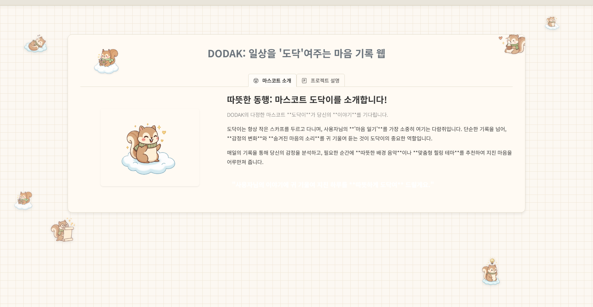

# DODAK(도닥) 화면 설계서

## 문서 정보

| 항목 | 내용 |
|------|------|
| 프로젝트명 | DODAK (도닥) - AI 기반 감정 일기 & 심리 케어 플랫폼 |
| 문서 버전 | 1.1 |
| 작성일 | 2026-02-09 |
| 작성자 | 주현준 (프론트엔드) |
| 총 화면 수 | 15개 (공개 3 + 회원 4 + 의사 5 + 병원 2 + 공통 1) |

---

## 1. 화면 목록

| 화면 ID | 화면명 | 경로 | 접근 권한 | 분류 | 관련 요구사항 | 관련 유스케이스 | 관련 테스트케이스 |
|---------|--------|------|----------|------|--------------|----------------|------------------|
| SCR-PUB-001 | 메인 랜딩 | `/` | Public | 공개 | - | - | TC-IDX-* |
| SCR-PUB-002 | 로그인 | `/login` | Public | 인증 | UR-001 | UC-AUTH-001 | TC-LGN-* |
| SCR-PUB-003 | 회원가입 | `/join` | Public | 인증 | UR-002 | UC-AUTH-002 | TC-SGN-* |
| SCR-MEM-001 | 회원 홈 | `/member/home` | USER, DOCTOR | 회원 | UR-003 | UC-MEM-001 | TC-MHM-* |
| SCR-MEM-002 | 일기 작성 | `/member/diary-write` | USER, DOCTOR | 회원 | DR-001, DR-002 | UC-DRY-001 | TC-DRW-* |
| SCR-MEM-003 | 일기 목록 | `/member/diary-list` | USER, DOCTOR | 회원 | DR-003 | UC-DRY-002 | TC-DRL-* |
| SCR-MEM-004 | 회원 마이페이지 | `/member/mypage` | USER, DOCTOR | 회원 | UR-004 | UC-MEM-002 | TC-MMP-* |
| SCR-DOC-001 | 의사 홈 | `/doctor/home` | DOCTOR | 의사 | - | UC-DOC-001 | TC-DHM-* |
| SCR-DOC-002 | 의사 대시보드 | `/doctor/dashboard` | DOCTOR | 의사 | DR-004, AR-001 | UC-DOC-002 | TC-DSH-* |
| SCR-DOC-003 | 환자 통계 | `/doctor/patient-stats` | DOCTOR | 의사 | AR-002 | UC-DOC-003 | TC-PST-* |
| SCR-DOC-004 | 환자 일기 목록 | `/doctor/patient-diary-list` | DOCTOR | 의사 | AR-003 | UC-DOC-004 | TC-PDL-* |
| SCR-DOC-005 | 의사 마이페이지 | `/doctor/mypage` | DOCTOR | 의사 | UR-004, AR-004 | UC-DOC-005 | TC-DMP-* |
| SCR-HSP-001 | 병원 검색 팝업 | `/hospital/searchPopup` | Public | 병원 | HR-001 | UC-HSP-001 | TC-HSS-* |
| SCR-HSP-002 | 병원 등록 폼 | `/hospital/addForm` | Public | 병원 | HR-002 | UC-HSP-002 | TC-HSA-* |
| SCR-CMN-001 | 일기 상세 모달 | (오버레이) | USER, DOCTOR | 공통 | DR-003 | UC-DRY-003 | TC-DDM-* |

---

## 2. 공통 레이아웃

### 2.1 회원 레이아웃 (Member Layout)

```
+------------------------------------------------------------------+
| [도닥이 로고]  DODAK                          [프로필] [로그아웃]   |
+----------+-------------------------------------------------------+
|          |                                                       |
| 네비바   |                  메인 콘텐츠 영역                      |
|          |                                                       |
| * 홈     |                                                       |
| * 일기   |                                                       |
|   작성   |                                                       |
| * 일기   |                                                       |
|   목록   |                                                       |
| * 마이   |                                                       |
|   페이지 |                                                       |
|          |                                                       |
| * 로그   |                                                       |
|   아웃   |                                                       |
|          |                                                       |
+----------+-------------------------------------------------------+
```

- **적용 대상**: `/member/**` 모든 페이지
- **Thymeleaf Fragment**: `fragments/member-navbar.html`
- **배경**: 베이지톤 격자무늬 패턴

### 2.2 의사 레이아웃 (Doctor Layout)

```
+------------------------------------------------------------------+
| [도닥이 로고]  DODAK (의사)                   [프로필] [로그아웃]   |
+----------+-------------------------------------------------------+
|          |                                                       |
| 네비바   |                  메인 콘텐츠 영역                      |
|          |                                                       |
| * 홈     |                                                       |
| * 대시   |                                                       |
|   보드   |                                                       |
| * 환자   |                                                       |
|   통계   |                                                       |
| * 환자   |                                                       |
|   일기   |                                                       |
| * 마이   |                                                       |
|   페이지 |                                                       |
| * 로그   |                                                       |
|   아웃   |                                                       |
|          |                                                       |
+----------+-------------------------------------------------------+
```

- **적용 대상**: `/doctor/**` 모든 페이지
- **Thymeleaf Fragment**: `fragments/doctor-navbar.html`

### 2.3 공통 Fragments

| Fragment | 파일 | 설명 |
|----------|------|------|
| head | `fragments/head.html` | `<head>` 태그 (CSS, 메타 태그) |
| background | `fragments/background.html` | 베이지 격자무늬 배경 |
| scripts | `fragments/scripts.html` | 공통 JavaScript |
| hospital-modal | `fragments/hospital-modal.html` | 병원 검색 모달 |
| diary-detail-modal | `fragments/diary-detail-modal.html` | 일기 상세 모달 |

---

## 3. 상세 화면 설계

### 3.1 메인 랜딩 페이지 (SCR-PUB-001)

| 항목 | 내용 |
|------|------|
| 화면 ID | SCR-PUB-001 |
| 화면명 | 메인 랜딩 페이지 |
| 경로 | `/` |
| 파일 | `templates/index.html` |
| 접근 권한 | 전체 공개 |
| 관련 API | - |
| 관련 요구사항 | - |
| 관련 유스케이스 | - |
| 관련 테스트케이스 | TC-IDX-001 ~ TC-IDX-003 |

> **스크린샷**: 

#### 화면 레이아웃

```
+------------------------------------------------------------------+
|  [로그인]  [회원가입]                                              |
+------------------------------------------------------------------+
|                                                                    |
|        DODAK: 일상을 '도닥'여주는 마음 기록 웹                      |
|                                                                    |
|  +----------+  +--------------+  +--------------+                  |
|  | 시작하기  |  | 마스코트소개  |  | 프로젝트설명  |                  |
|  +----------+  +--------------+  +--------------+                  |
|                                                                    |
|    +---------------------------------------------------+           |
|    |                                                   |           |
|    |    [도닥이 마스코트 이미지]                          |           |
|    |    (스카프 두른 다람쥐)                              |           |
|    |                                                   |           |
|    |    서비스 소개 콘텐츠                                |           |
|    |    - 마음 일기                                      |           |
|    |    - 감정 변화 추적                                  |           |
|    |    - 숨겨진 마음의 소리                              |           |
|    |                                                   |           |
|    +---------------------------------------------------+           |
|                                                                    |
|             [회원가입하기]  [로그인하기]                              |
|                                                                    |
+------------------------------------------------------------------+
```

#### UI 구성요소

| 요소 ID | 유형 | 설명 | 속성 |
|---------|------|------|------|
| logo | Image | 도닥이 마스코트 로고 | `static/img/dodak.png` |
| link_login | Link | 로그인 페이지 이동 | to: `/login` |
| btn_signup | Button | 회원가입 페이지 이동 | to: `/join` |
| tab_start | Tab | 시작하기 탭 | 서비스 소개 |
| tab_mascot | Tab | 마스코트 소개 탭 | 도닥이 소개 |
| tab_project | Tab | 프로젝트 설명 탭 | 프로젝트 배경 |

#### 이벤트 처리

| 이벤트 | 트리거 | 동작 |
|--------|--------|------|
| 로그인 이동 | link_login 클릭 | `/login`으로 이동 |
| 회원가입 이동 | btn_signup 클릭 | `/join`으로 이동 |
| 탭 전환 | tab 클릭 | 해당 콘텐츠 영역 표시 |

---

### 3.2 로그인 페이지 (SCR-PUB-002)

| 항목 | 내용 |
|------|------|
| 화면 ID | SCR-PUB-002 |
| 화면명 | 로그인 |
| 경로 | `/login` |
| 파일 | `templates/login.html` |
| 접근 권한 | 전체 공개 |
| 관련 API | POST `/loginProc` (Spring Security) |
| 관련 요구사항 | UR-001 |
| 관련 유스케이스 | UC-AUTH-001 |
| 관련 테스트케이스 | TC-LGN-001 ~ TC-LGN-008 |

> **스크린샷**: 

#### 화면 레이아웃

```
+------------------------------------------------------------------+
|                                                                    |
|              [도닥이 마스코트 이미지]                                |
|                                                                    |
|         "도닥이가 당신의 이야기를 기다립니다"                         |
|                                                                    |
|    +--------------------------------------+                        |
|    |  아이디    [                        ] |                        |
|    |  비밀번호  [                        ] |                        |
|    |                                      |                        |
|    |          [    로그인    ]             |                        |
|    |                                      |                        |
|    |  비밀번호 찾기  |  회원가입            |                        |
|    |  메인으로 돌아가기                     |                        |
|    +--------------------------------------+                        |
|                                                                    |
+------------------------------------------------------------------+
```

#### UI 구성요소

| 요소 ID | 유형 | 설명 | 속성 |
|---------|------|------|------|
| input_id | Input | 아이디 입력 | type: text, required |
| input_pw | Input | 비밀번호 입력 | type: password, required |
| btn_login | Button | 로그인 실행 | POST `/loginProc` |
| link_signup | Link | 회원가입 이동 | to: `/join` |
| link_home | Link | 메인으로 돌아가기 | to: `/` |

#### 이벤트 처리

| 이벤트 | 트리거 | 동작 |
|--------|--------|------|
| 로그인 | btn_login 클릭 | 1. `POST /loginProc` Spring Security 처리<br>2. 성공: `CustomAuthSuccessHandler` -> USER: `/member/home`, DOCTOR: `/doctor/home`<br>3. 실패: `/login?error=true` |
| 회원가입 | link_signup 클릭 | `/join`으로 이동 |

---

### 3.3 회원가입 페이지 (SCR-PUB-003)

| 항목 | 내용 |
|------|------|
| 화면 ID | SCR-PUB-003 |
| 화면명 | 회원가입 |
| 경로 | `/join` |
| 파일 | `templates/member/addUser.html` |
| 접근 권한 | 전체 공개 |
| 관련 API | POST `/api/members/join`, GET `/api/members/checkId`, GET `/api/members/checkEmail` |
| 관련 요구사항 | UR-002 |
| 관련 유스케이스 | UC-AUTH-002 |
| 관련 테스트케이스 | TC-SGN-001 ~ TC-SGN-012 |

> **스크린샷**: 

#### 화면 레이아웃

```
+------------------------------------------------------------------+
|                         회원가입                                    |
+------------------------------------------------------------------+
|                                                                    |
|  -- 기본 정보 ---------------------------------------------------- |
|  프로필 이미지  [파일 선택]                                         |
|  가입 역할     [일반회원 v] / [의사]                                |
|  아이디        [             ] [중복 체크]                          |
|  이름          [             ]                                     |
|  비밀번호      [             ] (8~20자, 영문+숫자+특수문자)          |
|  비밀번호 확인 [             ]                                      |
|                                                                    |
|  -- 연락 정보 ---------------------------------------------------- |
|  휴대전화      [             ]                                     |
|  이메일        [             ] [중복 체크]                          |
|                                                                    |
|  -- 주소 정보 ---------------------------------------------------- |
|  우편번호      [        ] [검색]                                    |
|  도로명 주소   [                                    ]               |
|  상세 주소     [                                    ]               |
|                                                                    |
|  -- 약관 동의 ---------------------------------------------------- |
|  [v] DODAK 이용 약관 (필수)                                        |
|  [v] 개인정보 처리 방침 (필수)                                      |
|  [ ] 마케팅 정보 수신 (선택)                                        |
|                                                                    |
|                    [    가입하기    ]                                |
|                                                                    |
+------------------------------------------------------------------+
```

#### UI 구성요소

| 요소 ID | 유형 | 설명 | 속성 |
|---------|------|------|------|
| input_profile | File | 프로필 이미지 | 이미지 파일만 허용 |
| select_role | Select | 가입 역할 | options: USER/DOCTOR |
| input_userId | Input | 아이디 | 5~20자, 영문+숫자 |
| btn_checkId | Button | 아이디 중복 체크 | GET `/api/members/checkId` |
| input_name | Input | 이름 | required |
| input_password | Input | 비밀번호 | 8~20자, 영문+숫자+특수문자 |
| input_pwConfirm | Input | 비밀번호 확인 | 비밀번호 일치 검증 |
| input_phone | Input | 휴대전화 | 전화번호 형식 |
| input_email | Input | 이메일 | 이메일 형식 |
| btn_checkEmail | Button | 이메일 중복 체크 | GET `/api/members/checkEmail` |
| btn_zipSearch | Button | 우편번호 검색 | Daum 주소 API |
| btn_submit | Button | 회원가입 실행 | POST `/api/members/join` |

#### 실시간 검증

| 필드 | 검증 규칙 | 표시 |
|------|----------|------|
| 아이디 | 5~20자, 영문+숫자, 중복 체크 필수 | 중복 체크 결과 메시지 |
| 비밀번호 | 8~20자, 영문+숫자+특수문자 | 규칙 미충족 시 안내 메시지 |
| 비밀번호 확인 | 비밀번호와 일치 | 불일치 시 빨간 테두리 |
| 이메일 | 이메일 형식, 중복 체크 | 중복 체크 결과 메시지 |
| 약관 | 필수 약관 2개 동의 필수 | 미동의 시 가입 버튼 비활성화 |

---

### 3.4 회원 홈 (SCR-MEM-001)

| 항목 | 내용 |
|------|------|
| 화면 ID | SCR-MEM-001 |
| 화면명 | 회원 메인 페이지 |
| 경로 | `/member/home` |
| 파일 | `templates/member/home.html` |
| 접근 권한 | USER, DOCTOR |
| 관련 API | - |
| 관련 요구사항 | UR-003 |
| 관련 유스케이스 | UC-MEM-001 |
| 관련 테스트케이스 | TC-MHM-001 ~ TC-MHM-005 |

> **스크린샷**: 

#### 화면 레이아웃

```
+----------+-------------------------------------------------------+
|          |                                                       |
| 네비바   |  "따뜻한 동행: 마스코트 도닥이를 소개합니다!"              |
|          |                                                       |
| * 홈     |  +--------------+  +------------------------------+  |
| * 일기   |  |              |  |                              |  |
|   작성   |  |  [도닥이]     |  |  도닥이는 스카프를 두른       |  |
| * 일기   |  |  (다람쥐)    |  |  다람쥐 캐릭터입니다.         |  |
|   목록   |  |              |  |                              |  |
| * 마이   |  +--------------+  |  - 마음 일기                 |  |
|   페이지 |                     |  - 감정 변화 추적            |  |
|          |                     |  - 맞춤형 힐링 테마          |  |
| * 로그   |                     +------------------------------+  |
|   아웃   |                                                       |
|          |  [마스코트 소개]  [프로젝트 설명]  <- 탭                 |
|          |                                                       |
+----------+-------------------------------------------------------+
```

#### UI 구성요소

| 요소 ID | 유형 | 설명 |
|---------|------|------|
| mascot_image | Image | 도닥이 마스코트 이미지 |
| tab_mascot | Tab | 마스코트 소개 탭 |
| tab_project | Tab | 프로젝트 설명 탭 |
| content_area | Section | 탭별 콘텐츠 영역 |

---

### 3.5 일기 작성 (SCR-MEM-002)

| 항목 | 내용 |
|------|------|
| 화면 ID | SCR-MEM-002 |
| 화면명 | 일기 작성 |
| 경로 | `/member/diary-write` |
| 파일 | `templates/member/diary-write.html` |
| JS | `static/js/member/diary-write.js` |
| 접근 권한 | USER, DOCTOR |
| 관련 API | POST `/api/diaries`, GET `/diary?s=` (FastAPI), POST `/youtube/search` (FastAPI) |
| 관련 요구사항 | DR-001, DR-002 |
| 관련 유스케이스 | UC-DRY-001 |
| 관련 테스트케이스 | TC-DRW-001 ~ TC-DRW-015 |

> **스크린샷**: 

#### 화면 레이아웃

```
+----------+-------------------------------------------------------+
|          |                                                       |
| 네비바   |  2026년 2월 9일 (일)                                   |
|          |                                                       |
|          |  -- 오늘의 감정 --------------------------------       |
|          |  [분노] [불안] [슬픔] [기쁨] [후회]                    |
|          |  [희망] [중립] [피로] [우울]                            |
|          |   빨강   주황   파랑  초록   보라                       |
|          |   하늘   회색   검정  남색                              |
|          |                                                       |
|          |  -- 일기 내용 ----------------------------------       |
|          |  제목  [                              ] (30자)         |
|          |                                                       |
|          |  내용  +----------------------------+                  |
|          |        |                            |                  |
|          |        |  (자유 형식 텍스트 입력)     |                  |
|          |        |                            |                  |
|          |        |                            |                  |
|          |        +----------------------------+ (1000자)         |
|          |                                                       |
|          |  첨부파일  [파일 선택] (최대 3개, 10MB)                  |
|          |                                                       |
|          |  [일기 저장하기]  [기분에 따른 추천 영상 목록보기]        |
|          |                                                       |
+----------+-------------------------------------------------------+
```

#### 감정 칩 색상 매핑

| 감정 | 영문 | 색상 | HEX |
|------|------|------|-----|
| 분노 | anger | 빨강 | #FF4444 |
| 불안 | anxiety | 주황 | #FF8C00 |
| 슬픔 | sadness | 파랑 | #4169E1 |
| 기쁨 | joy | 초록 | #2E8B57 |
| 후회 | regret | 보라 | #8B008B |
| 희망 | hope | 하늘 | #87CEEB |
| 중립 | neutrality | 회색 | #808080 |
| 피로 | tiredness | 검정 | #333333 |
| 우울 | depression | 남색 | #191970 |

#### 이벤트 처리

| 이벤트 | 트리거 | 동작 |
|--------|--------|------|
| 감정 선택 | 감정 칩 클릭 | 선택 상태 토글, 복수 선택 가능 |
| 일기 저장 | btn_save 클릭 | 1. POST `/api/diaries` (일기 저장)<br>2. 자동으로 FastAPI `/diary?s=` 호출 (AI 감정 분석)<br>3. 분석 결과 `tb_analysis`에 저장 |
| 음악 추천 | btn_music 클릭 | 선택된 감정 기반 FastAPI `/youtube/search` 호출 |

---

### 3.6 일기 목록 (SCR-MEM-003)

| 항목 | 내용 |
|------|------|
| 화면 ID | SCR-MEM-003 |
| 화면명 | 일기 목록 |
| 경로 | `/member/diary-list` |
| 파일 | `templates/member/diary-list.html` |
| JS | `static/js/member/diary-list.js` |
| 접근 권한 | USER, DOCTOR |
| 관련 API | GET `/api/diaries`, GET `/api/diaries/search` |
| 관련 요구사항 | DR-003 |
| 관련 유스케이스 | UC-DRY-002 |
| 관련 테스트케이스 | TC-DRL-001 ~ TC-DRL-010 |

> **스크린샷**: 

#### 화면 레이아웃

```
+----------+-------------------------------------------------------+
|          |                                                       |
| 네비바   |  총 8개의 일기가 기록되어 있습니다                       |
|          |                                                       |
|          |  -- 검색 필터 ----------------------------------       |
|          |  연도 [2026 v] 월 [2 v] 일 [전체 v]  [검색]           |
|          |  키워드 [                    ]  [검색]                  |
|          |                                                       |
|          |  -- 일기 목록 ----------------------------------       |
|          |  +--------------------------------------------------+ |
|          |  | 2026-02-09  "오늘의 일기"                          | |
|          |  | [피로] [슬픔]  오늘은 회사에서 너무 힘...            | |
|          |  +--------------------------------------------------+ |
|          |  +--------------------------------------------------+ |
|          |  | 2026-02-08  "좋은 하루"                            | |
|          |  | [기쁨] [희망]  친구를 만나서 즐거운...               | |
|          |  +--------------------------------------------------+ |
|          |  +--------------------------------------------------+ |
|          |  | 2026-02-07  "불안한 밤"                            | |
|          |  | [불안] [피로]  내일 면접이 걱정...                  | |
|          |  +--------------------------------------------------+ |
|          |                                                       |
|          |          [< 이전]  1  2  3  [다음 >]                   |
|          |                                                       |
+----------+-------------------------------------------------------+
```

#### 일기 카드 구성 요소

| 요소 | 설명 |
|------|------|
| 작성일시 | 일기 작성 날짜 표시 |
| 일기 제목 | 일기 제목 텍스트 |
| 감정 배지 | 분석된 주요 감정의 컬러 배지 |
| 내용 미리보기 | 내용 50자 미리보기 |
| 클릭 동작 | 클릭 시 일기 상세 모달 (SCR-CMN-001) 표시 |

---

### 3.7 회원 마이페이지 (SCR-MEM-004)

| 항목 | 내용 |
|------|------|
| 화면 ID | SCR-MEM-004 |
| 화면명 | 회원 마이페이지 |
| 경로 | `/member/mypage` |
| 파일 | `templates/member/mypage.html` |
| JS | `static/js/member/mypage.js` |
| 접근 권한 | USER, DOCTOR |
| 관련 API | GET `/api/members/info/{id}`, PUT `/api/members/update` |
| 관련 요구사항 | UR-004 |
| 관련 유스케이스 | UC-MEM-002 |
| 관련 테스트케이스 | TC-MMP-001 ~ TC-MMP-010 |

> **스크린샷**: 

#### 화면 레이아웃

```
+----------+-------------------------------------------------------+
|          |                                                       |
| 네비바   |  -- 기본 정보 ----------------------------------       |
|          |  프로필 이미지  [이미지 변경]                           |
|          |  가입 역할     일반회원 (읽기전용)                      |
|          |  아이디        testuser (읽기전용)                      |
|          |  이름          [홍길동              ]                   |
|          |  비밀번호      [변경할 비밀번호      ]                   |
|          |                                                       |
|          |  -- 연락 정보 ----------------------------------       |
|          |  휴대전화      [010-1234-5678       ]                  |
|          |  이메일        [hong@test.com       ] [중복 체크]       |
|          |                                                       |
|          |  -- 주소 정보 ----------------------------------       |
|          |  우편번호      [12345   ] [검색]                        |
|          |  도로명 주소   [서울시 강남구 ...     ]                  |
|          |  상세 주소     [123호                ]                  |
|          |                                                       |
|          |  [ ] 마케팅 정보 수신 동의 (선택)                       |
|          |                                                       |
|          |            [   회원 정보 수정   ]                       |
|          |                                                       |
+----------+-------------------------------------------------------+
```

---

### 3.8 의사 홈 (SCR-DOC-001)

| 항목 | 내용 |
|------|------|
| 화면 ID | SCR-DOC-001 |
| 화면명 | 의사 메인 페이지 |
| 경로 | `/doctor/home` |
| 파일 | `templates/doctor/home.html` |
| 접근 권한 | DOCTOR |
| 관련 API | - |
| 관련 요구사항 | - |
| 관련 유스케이스 | UC-DOC-001 |
| 관련 테스트케이스 | TC-DHM-001 ~ TC-DHM-003 |

> **스크린샷**: 

- 회원 홈과 유사한 마스코트 소개 레이아웃
- 의사 전용 네비게이션 바 (대시보드, 환자 통계, 환자 일기, 마이페이지)

---

### 3.9 의사 대시보드 (SCR-DOC-002)

| 항목 | 내용 |
|------|------|
| 화면 ID | SCR-DOC-002 |
| 화면명 | 의사 대시보드 |
| 경로 | `/doctor/dashboard` |
| 파일 | `templates/doctor/dashboard.html` |
| JS | `static/js/doctor/dashboard.js` |
| 접근 권한 | DOCTOR |
| 관련 API | GET `/api/analyses/dashboard/{doctId}` |
| 관련 요구사항 | DR-004, AR-001 |
| 관련 유스케이스 | UC-DOC-002 |
| 관련 테스트케이스 | TC-DSH-001 ~ TC-DSH-012 |

> **스크린샷**: 

#### 화면 레이아웃

```
+----------+-------------------------------------------------------+
|          |                                                       |
| 네비바   |  -- 요약 카드 (4개) -----------------------------      |
|          |  +----------+ +----------+ +----------+ +----------+ |
|          |  | 배정환자  | | 중증환자  | | 이번달   | | 평균     | |
|          |  |   8명    | |   1명    | | 일기 0건  | | 행복 5.8%| |
|          |  |  (파랑)  | |  (빨강)  | |  (주황)  | |  (노랑)  | |
|          |  +----------+ +----------+ +----------+ +----------+ |
|          |                                                       |
|          |  +---------------------+ +-------------------------+ |
|          |  |                     | |                         | |
|          |  |  전체 환자 감정 분포 | |  최근 7일 일기 작성 추이 | |
|          |  |  (파이 차트)        | |  (라인 차트)            | |
|          |  |                     | |                         | |
|          |  +---------------------+ +-------------------------+ |
|          |                                                       |
|          |  +---------------------+ +-------------------------+ |
|          |  | 중증 환자 현황       | | 최근 일기 작성 현황      | |
|          |  | 환자명  우울지수     | | 날짜  환자  내용미리보기  | |
|          |  | 김XX   85%  [주의]  | | 02-09 이XX  오늘은...    | |
|          |  |                     | | 02-08 박XX  힘들었...    | |
|          |  +---------------------+ +-------------------------+ |
|          |                                                       |
|          |  +-------------------------------------------------+  |
|          |  | 월별 감정 추이 (전체 환자) - 막대 차트              |  |
|          |  | (기쁨/우울/불안 월별 비교)                           |  |
|          |  +-------------------------------------------------+  |
|          |                                                       |
+----------+-------------------------------------------------------+
```

#### 차트 데이터 소스

| 차트 | API | 응답 필드 |
|------|-----|----------|
| 감정 분포 파이 차트 | `/api/analyses/dashboard/{doctId}` | emotionSummary |
| 최근 7일 추이 | `/api/analyses/dashboard/{doctId}` | weeklyDiaryCounts |
| 월별 감정 추이 | `/api/analyses/dashboard/{doctId}` | monthlyEmotionTrends |
| 중증 환자 | `/api/analyses/dashboard/{doctId}` | severePatients |
| 최근 일기 | `/api/analyses/dashboard/{doctId}` | recentDiaries |

---

### 3.10 환자 통계 (SCR-DOC-003)

| 항목 | 내용 |
|------|------|
| 화면 ID | SCR-DOC-003 |
| 화면명 | 환자 통계 |
| 경로 | `/doctor/patient-stats` |
| 파일 | `templates/doctor/patient-stats.html` |
| JS | `static/js/doctor/patient-stats.js` |
| 접근 권한 | DOCTOR |
| 관련 API | GET `/api/analyses/stats/{memberId}?year={year}&month={month}` |
| 관련 요구사항 | AR-002 |
| 관련 유스케이스 | UC-DOC-003 |
| 관련 테스트케이스 | TC-PST-001 ~ TC-PST-010 |

> **스크린샷**: 

#### 화면 레이아웃

```
+----------+-------------------------------------------------------+
|          |                                                       |
| 네비바   |  환자 선택 [이수진 v]   연 [2026 v] 월 [2 v]          |
|          |                                                       |
|          |  -- 이 달의 마음 상태 -------------------------         |
|          |  +-------------------+ +-----------------------+      |
|          |  | 종합 우울지수      | | 종합 행복지수          |      |
|          |  |   35.2%           | |   28.5%               |      |
|          |  |   [주의]          | |   [보통]              |      |
|          |  +-------------------+ +-----------------------+      |
|          |                                                       |
|          |  -- 가장 부정적이었던 날 (TOP 3) ---------------       |
|          |  1위: 2/5 - "무너지는 기분" (우울: 82%)                |
|          |  2위: 2/12 - "또 실수했다" (후회: 71%)                 |
|          |  3위: 2/8 - "너무 불안해" (불안: 65%)                  |
|          |                                                       |
|          |  -- 종합 마음 추이 차트 -------------------------       |
|          |  +---------------------------------------------+      |
|          |  |  (일별 감정 변화 시계열 그래프)               |      |
|          |  |  기쁨 --- / 슬픔 --- / 불안 ---             |      |
|          |  +---------------------------------------------+      |
|          |                                                       |
|          |  -- 행복/우울 지수 변화 차트 -------------------       |
|          |  +---------------------------------------------+      |
|          |  |  (이중 축 비교 차트)                          |      |
|          |  |  행복지수 --- vs 우울지수 ---                 |      |
|          |  +---------------------------------------------+      |
|          |                                                       |
+----------+-------------------------------------------------------+
```

#### 응답 DTO: `PatientStatsResponse`

| 필드 | 설명 |
|------|------|
| emotionAverages | 9개 감정 월평균 |
| dailyEmotions | 일별 감정 변화 |
| negativeDays | TOP 3 부정적 날 |
| overallIndicators | 행복/우울 지수 |

---

### 3.11 환자 일기 목록 (SCR-DOC-004)

| 항목 | 내용 |
|------|------|
| 화면 ID | SCR-DOC-004 |
| 화면명 | 환자 일기 목록 |
| 경로 | `/doctor/patient-diary-list` |
| 파일 | `templates/doctor/patient-diary-list.html` |
| JS | `static/js/doctor/patient-diary-list.js` |
| 접근 권한 | DOCTOR |
| 관련 API | GET `/api/diaries/patient/{memberId}` |
| 관련 요구사항 | AR-003 |
| 관련 유스케이스 | UC-DOC-004 |
| 관련 테스트케이스 | TC-PDL-001 ~ TC-PDL-008 |

> **스크린샷**: 

#### 화면 레이아웃

```
+----------+-------------------------------------------------------+
|          |                                                       |
| 네비바   |  환자 선택 [이수진 v]                                  |
|          |                                                       |
|          |  -- 검색 필터 ----------------------------------       |
|          |  연도 [2026 v] 월 [2 v] 일 [전체 v]  [검색]           |
|          |  키워드 [                    ]  [검색]                  |
|          |                                                       |
|          |  -- 환자 일기 목록 --------------------------------    |
|          |  (회원 일기 목록과 동일한 카드 형태)                     |
|          |  - 일기 제목, 작성일, 감정 배지, 내용 미리보기           |
|          |  - 클릭 시 상세 모달 (분석 결과 포함)                    |
|          |                                                       |
|          |          [< 이전]  1  2  [다음 >]                      |
|          |                                                       |
+----------+-------------------------------------------------------+
```

---

### 3.12 의사 마이페이지 (SCR-DOC-005)

| 항목 | 내용 |
|------|------|
| 화면 ID | SCR-DOC-005 |
| 화면명 | 의사 마이페이지 |
| 경로 | `/doctor/mypage` |
| 파일 | `templates/doctor/mypage.html` |
| JS | `static/js/doctor/mypage.js` |
| 접근 권한 | DOCTOR |
| 관련 API | GET `/api/members/info/{id}`, PUT `/api/members/update`, GET `/api/doctors/info`, POST `/api/arranges` |
| 관련 요구사항 | UR-004, AR-004 |
| 관련 유스케이스 | UC-DOC-005 |
| 관련 테스트케이스 | TC-DMP-001 ~ TC-DMP-012 |

> **스크린샷**: 

#### 화면 레이아웃

```
+----------+-------------------------------------------------------+
|          |                                                       |
| 네비바   |  -- 기본 정보 ----------------------------------       |
|          |  (회원 마이페이지와 동일)                                |
|          |  프로필 이미지, 역할(의사-읽기전용), 아이디, 이름 등      |
|          |                                                       |
|          |  -- 의사 정보 ----------------------------------       |
|          |  소속 병원   [마음건강병원    ] [병원 선택] [병원 추가]   |
|          |  전문 분야   [정신건강의학과   ]                         |
|          |                                                       |
|          |  -- 환자 배정 ----------------------------------       |
|          |  +--------------------------------------------------+ |
|          |  | 배정 환자 목록                                    | |
|          |  | 이수진, 김민수, 박지영 ...                         | |
|          |  |                                                   | |
|          |  | 미배정 환자 목록                                   | |
|          |  | 최예은, 정하늘 ...           [배정하기]             | |
|          |  +--------------------------------------------------+ |
|          |                                                       |
|          |            [   회원 정보 수정   ]                       |
|          |                                                       |
+----------+-------------------------------------------------------+
```

---

### 3.13 병원 검색 팝업 (SCR-HSP-001)

| 항목 | 내용 |
|------|------|
| 화면 ID | SCR-HSP-001 |
| 화면명 | 병원 검색 팝업 |
| 경로 | `/hospital/searchPopup` |
| 파일 | `templates/hospital/searchPopup.html` |
| 접근 권한 | 전체 공개 |
| 관련 API | GET `/api/hospitals/search` |
| 관련 요구사항 | HR-001 |
| 관련 유스케이스 | UC-HSP-001 |
| 관련 테스트케이스 | TC-HSS-001 ~ TC-HSS-005 |

#### 화면 레이아웃

```
+-----------------------------------------------+
|              병원 검색                          |
+-----------------------------------------------+
|                                               |
|  병원명 [              ] [검색]                |
|                                               |
|  -- 검색 결과 ------------------------------- |
|  마음건강병원   서울시 강남구 ...   [선택]      |
|  행복정신병원   서울시 서초구 ...   [선택]      |
|  힐링클리닉     부산시 해운대구 ... [선택]      |
|                                               |
|                         [닫기]                 |
+-----------------------------------------------+
```

---

### 3.14 병원 등록 폼 (SCR-HSP-002)

| 항목 | 내용 |
|------|------|
| 화면 ID | SCR-HSP-002 |
| 화면명 | 병원 등록 |
| 경로 | `/hospital/addForm` |
| 파일 | `templates/hospital/addForm.html` |
| 접근 권한 | 전체 공개 |
| 관련 API | POST `/api/hospitals` |
| 관련 요구사항 | HR-002 |
| 관련 유스케이스 | UC-HSP-002 |
| 관련 테스트케이스 | TC-HSA-001 ~ TC-HSA-005 |

#### 화면 레이아웃

```
+-----------------------------------------------+
|              병원 등록                          |
+-----------------------------------------------+
|                                               |
|  병원명     [                              ]   |
|  우편번호   [        ] [검색]                   |
|  주소       [                              ]   |
|  상세주소   [                              ]   |
|  전화번호   [                              ]   |
|                                               |
|              [등록하기]                         |
|                                               |
+-----------------------------------------------+
```

---

### 3.15 일기 상세 모달 (SCR-CMN-001)

| 항목 | 내용 |
|------|------|
| 화면 ID | SCR-CMN-001 |
| 화면명 | 일기 상세 모달 |
| 경로 | (오버레이) |
| 파일 | `fragments/diary-detail-modal.html` |
| 접근 권한 | USER, DOCTOR |
| 관련 API | GET `/api/diaries/{diaryIdx}`, GET `/api/analyses/{diaryIdx}` |
| 관련 요구사항 | DR-003 |
| 관련 유스케이스 | UC-DRY-003 |
| 관련 테스트케이스 | TC-DDM-001 ~ TC-DDM-005 |

#### 화면 레이아웃

```
+---------------------------------------------------+
| 일기 상세                                     [X]  |
+---------------------------------------------------+
|                                                    |
|  제목: 오늘의 일기                                  |
|  작성일: 2026-02-09                                 |
|                                                    |
|  -- 내용 ----------------------------------------  |
|  오늘은 회사에서 너무 힘든 하루였다...               |
|                                                    |
|  -- AI 감정 분석 결과 ----------------------------  |
|  기쁨: 5.2%  | 슬픔: 35.1%  | 불안: 20.3%          |
|  분노: 8.0%  | 후회: 10.5%  | 희망: 3.2%           |
|  중립: 5.0%  | 피로: 12.7%  | 우울증: 28.0%        |
|                                                    |
|  -- 첨부파일 ------------------------------------  |
|  [이미지1.jpg]  [이미지2.jpg]                       |
|                                                    |
|             [수정]  [삭제]  [닫기]                   |
+---------------------------------------------------+
```

---

## 4. UI/UX 디자인 가이드

### 4.1 색상 팔레트

| 용도 | 색상 | HEX |
|------|------|-----|
| 배경 | 베이지 크림 | #F5F0E8 |
| 주요 텍스트 | 진한 갈색 | #4A3728 |
| 포인트 | 따뜻한 오렌지 | #E8A87C |
| 카드 배경 | 흰색 | #FFFFFF |
| 네비바 | 연한 갈색 | #D4C5B0 |

### 4.2 감정별 색상

| 감정 | 배지 색상 | 차트 색상 |
|------|----------|----------|
| 기쁨 | 초록 (#2E8B57) | rgba(46,139,87,0.7) |
| 희망 | 하늘 (#87CEEB) | rgba(135,206,235,0.7) |
| 중립 | 회색 (#808080) | rgba(128,128,128,0.7) |
| 분노 | 빨강 (#FF4444) | rgba(255,68,68,0.7) |
| 슬픔 | 파랑 (#4169E1) | rgba(65,105,225,0.7) |
| 불안 | 주황 (#FF8C00) | rgba(255,140,0,0.7) |
| 피로 | 검정 (#333333) | rgba(51,51,51,0.7) |
| 후회 | 보라 (#8B008B) | rgba(139,0,139,0.7) |
| 우울 | 남색 (#191970) | rgba(25,25,112,0.7) |

---

## 변경 이력

| 버전 | 날짜 | 변경 내용 | 작성자 |
|------|------|-----------|--------|
| 1.0 | 2026-02-09 | 최초 작성 (15개 화면 설계) | 주현준 |
| 1.1 | 2026-02-09 | DOT-Project 형식 적용 (화면 ID, API, 요구사항, 유스케이스, 테스트케이스 매핑 추가), UI 구성요소/이벤트 처리 상세 추가 | 주현준 |
