# Dodak 유스케이스 다이어그램

## 문서 정보

| 항목 | 내용 |
|------|------|
| 프로젝트명 | Dodak (AI 기반 감정 일기 & 심리 케어 플랫폼) |
| 문서 버전 | 1.1 |
| 작성일 | 2026-02-09 |

---

## 1. 액터 정의

### 1.1 액터 목록

| 액터 | 설명 |
|------|------|
| **비회원 (Guest)** | 시스템에 로그인하지 않은 사용자. 로그인과 회원가입만 가능 |
| **환자 (User)** | 시스템에 로그인한 일반 사용자. 일기 작성, 감정 분석, 챗봇 상담, 음악 추천, 마이페이지 사용 가능 |
| **의사 (Doctor)** | 시스템에 로그인한 전문가. 대시보드, 환자 배정, 환자 통계, 환자 일기 열람, 마이페이지 사용 가능 |
| **AI 시스템** | 감정 분석(KoBERT) 및 챗봇 응답(KoGPT2/KoBERT)을 수행하는 FastAPI AI 서버 |
| **YouTube** | 감정 맞춤형 음악 콘텐츠를 제공하는 외부 서비스 (Selenium 크롤링) |

### 1.2 액터 계층 구조

```
        ┌─────────┐
        │  Guest  │
        └────┬────┘
        ┌────┴────────────┐
        │ extends         │ extends
   ┌────▼────┐       ┌────▼────┐
   │  User   │       │ Doctor  │
   └─────────┘       └─────────┘
```

---

## 2. 전체 시스템 유스케이스 다이어그램

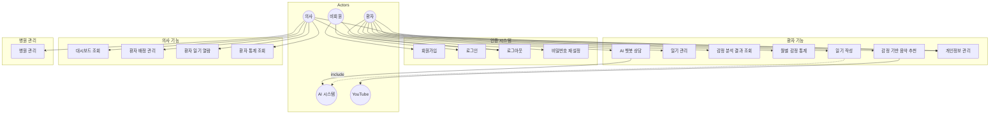

---

## 3. 상세 유스케이스 다이어그램

### 3.1 인증 시스템

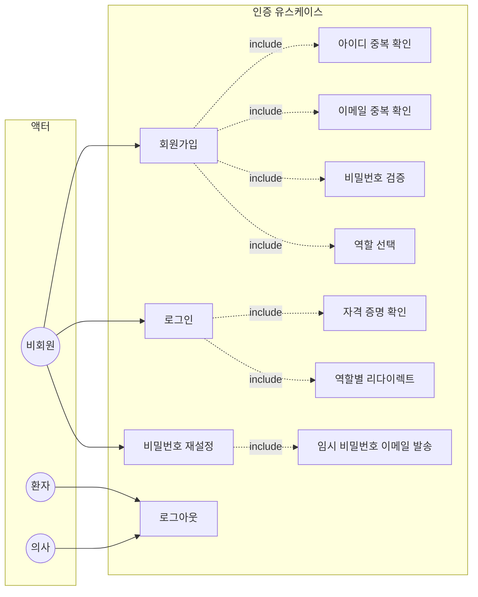

#### 유스케이스 명세: 회원가입 (UC-AUTH-001)

| 항목 | 내용 |
|------|------|
| **유스케이스 ID** | UC-AUTH-001 |
| **유스케이스명** | 회원가입 |
| **액터** | 비회원 (Guest) |
| **관련 화면** | SCR-PUB-003 |
| **관련 요구사항** | M-01 |
| **관련 테스트케이스** | TC-SGN-001 ~ TC-SGN-015 |
| **사전조건** | - 시스템 접속 상태<br>- 로그인되지 않은 상태 |
| **사후조건** | - 신규 계정 생성 (tb_member)<br>- 의사 역할인 경우 tb_doctor 레코드 추가 생성<br>- 로그인 페이지로 이동 |
| **기본 흐름** | 1. 비회원이 회원가입 페이지(`/join`)에 접근한다<br>2. 시스템이 회원가입 양식을 표시한다<br>3. 비회원이 가입 역할을 선택한다 (일반회원 / 의사)<br>4. 비회원이 필수 정보를 입력한다 (아이디, 이름, 비밀번호, 이메일, 전화번호)<br>5. 비회원이 주소 정보를 입력한다 (우편번호 검색)<br>6. 비회원이 프로필 이미지를 첨부한다 (선택사항)<br>7. 비회원이 필수 약관에 동의한다<br>8. 비회원이 "가입하기" 버튼을 클릭한다<br>9. 시스템이 입력값을 검증한다<br>10. 시스템이 아이디/이메일 중복을 확인한다<br>11. 시스템이 비밀번호를 BCrypt로 암호화한다<br>12. 시스템이 회원 정보를 저장한다<br>13. 시스템이 로그인 페이지로 이동한다 |
| **대안 흐름** | 9a. 비밀번호가 규칙(8~20자, 영문+숫자+특수문자)에 맞지 않는 경우<br>&nbsp;&nbsp;&nbsp;-> 실시간 오류 메시지 표시<br>10a. 아이디가 이미 등록된 경우<br>&nbsp;&nbsp;&nbsp;-> "이미 사용 중인 아이디" 메시지 표시<br>10b. 이메일이 이미 등록된 경우<br>&nbsp;&nbsp;&nbsp;-> "이미 사용 중인 이메일" 메시지 표시<br>7a. 필수 약관 미동의 시<br>&nbsp;&nbsp;&nbsp;-> 약관 동의 필수 안내 |
| **예외 흐름** | - 서버 오류 시 오류 메시지 표시 |

#### 유스케이스 명세: 로그인 (UC-AUTH-002)

| 항목 | 내용 |
|------|------|
| **유스케이스 ID** | UC-AUTH-002 |
| **유스케이스명** | 로그인 |
| **액터** | 비회원 (Guest) |
| **관련 화면** | SCR-PUB-002 |
| **관련 요구사항** | M-02 |
| **관련 테스트케이스** | TC-LGN-001 ~ TC-LGN-011 |
| **사전조건** | - 등록된 계정 존재<br>- 로그인되지 않은 상태 |
| **사후조건** | - Spring Security 세션 생성<br>- 역할에 따른 페이지로 이동 |
| **기본 흐름** | 1. 비회원이 로그인 페이지(`/login`)에 접근한다<br>2. 시스템이 로그인 양식을 표시한다 (도닥이 마스코트 이미지 포함)<br>3. 비회원이 아이디와 비밀번호를 입력한다<br>4. 비회원이 "로그인" 버튼을 클릭한다<br>5. 시스템이 `POST /loginProc`로 Spring Security 인증을 수행한다<br>6. 시스템이 BCrypt 비밀번호를 검증한다<br>7. `CustomAuthSuccessHandler`가 역할에 따라 리다이렉트한다<br>&nbsp;&nbsp;&nbsp;- USER -> `/member/home`<br>&nbsp;&nbsp;&nbsp;- DOCTOR -> `/doctor/home` |
| **대안 흐름** | 6a. 아이디가 존재하지 않는 경우<br>&nbsp;&nbsp;&nbsp;-> `/login?error=true`로 이동, 에러 메시지 표시<br>6b. 비밀번호가 일치하지 않는 경우<br>&nbsp;&nbsp;&nbsp;-> `/login?error=true`로 이동, 에러 메시지 표시 |
| **예외 흐름** | - 서버 오류 시 오류 메시지 표시 |

#### 유스케이스 명세: 로그아웃 (UC-AUTH-003)

| 항목 | 내용 |
|------|------|
| **유스케이스 ID** | UC-AUTH-003 |
| **유스케이스명** | 로그아웃 |
| **액터** | 환자 (User), 의사 (Doctor) |
| **관련 화면** | 공통 (사이드바 네비게이션) |
| **관련 요구사항** | M-03 |
| **관련 테스트케이스** | TC-LGN-009 |
| **사전조건** | - 로그인 상태 |
| **사후조건** | - Spring Security 세션 종료<br>- 메인 랜딩 페이지(`/`)로 이동 |
| **기본 흐름** | 1. 사용자가 사이드바의 "로그아웃" 메뉴를 클릭한다<br>2. 시스템이 세션을 종료한다<br>3. 시스템이 메인 랜딩 페이지로 이동한다 |

#### 유스케이스 명세: 비밀번호 재설정 (UC-AUTH-004)

| 항목 | 내용 |
|------|------|
| **유스케이스 ID** | UC-AUTH-004 |
| **유스케이스명** | 비밀번호 재설정 |
| **액터** | 비회원 (Guest) |
| **관련 화면** | SCR-PUB-002 (비밀번호 찾기 링크) |
| **관련 요구사항** | M-04 |
| **관련 테스트케이스** | TC-PWD-001 ~ TC-PWD-004 |
| **사전조건** | - 가입된 계정 존재<br>- 로그인되지 않은 상태 |
| **사후조건** | - 임시 비밀번호 이메일 발송<br>- DB 비밀번호 BCrypt 업데이트 |
| **기본 흐름** | 1. 비회원이 로그인 페이지에서 "비밀번호 찾기" 링크를 클릭한다<br>2. 시스템이 비밀번호 재설정 폼을 표시한다<br>3. 비회원이 아이디와 이메일을 입력한다<br>4. 비회원이 재설정 요청 버튼을 클릭한다<br>5. 시스템이 아이디와 이메일 일치 여부를 확인한다<br>6. 시스템이 임시 비밀번호를 생성하고 BCrypt 암호화하여 저장한다<br>7. 시스템이 임시 비밀번호를 이메일로 발송한다 |
| **대안 흐름** | 5a. 미등록 아이디인 경우<br>&nbsp;&nbsp;&nbsp;-> 에러 메시지 표시<br>5b. 이메일이 아이디와 일치하지 않는 경우<br>&nbsp;&nbsp;&nbsp;-> 에러 메시지 표시 |
| **예외 흐름** | - 이메일 발송 실패 시 오류 메시지 표시 |

---

### 3.2 일기 관리 시스템

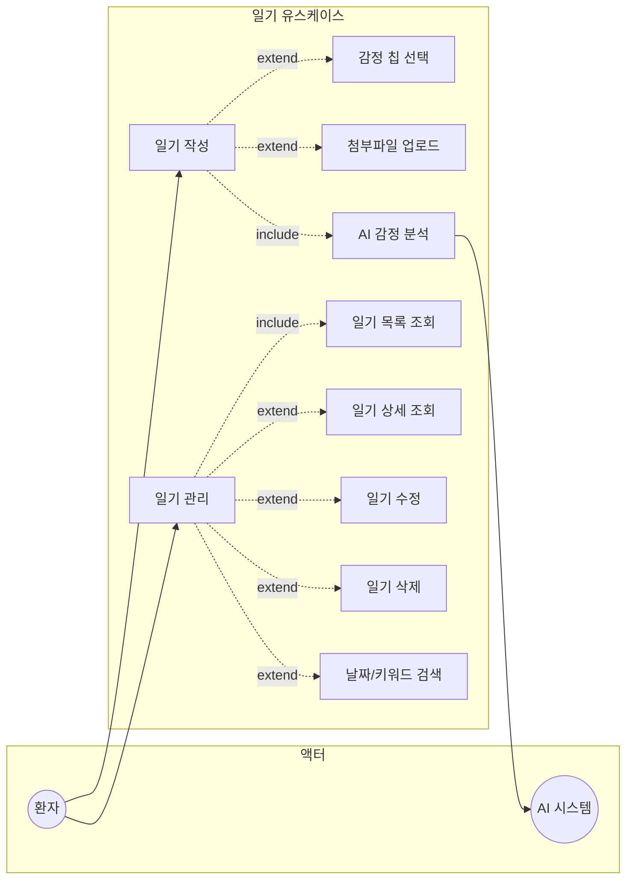

#### 유스케이스 명세: 일기 작성 (UC-DIARY-001)

| 항목 | 내용 |
|------|------|
| **유스케이스 ID** | UC-DIARY-001 |
| **유스케이스명** | 일기 작성 |
| **액터** | 환자 (User), AI 시스템 |
| **관련 화면** | SCR-MEM-002 |
| **관련 요구사항** | D-01, A-01, A-02, A-03 |
| **관련 테스트케이스** | TC-DRW-001 ~ TC-DRW-014, TC-ANL-001 ~ TC-ANL-012 |
| **사전조건** | - USER 권한으로 로그인 상태 |
| **사후조건** | - 일기가 tb_diary에 저장됨<br>- AI 감정 분석 결과가 tb_analysis에 저장됨 |
| **기본 흐름** | 1. 사용자가 일기 작성 페이지(`/member/diary-write`)에 접근한다<br>2. 시스템이 오늘 날짜와 9가지 감정 칩을 표시한다<br>3. 사용자가 감정 칩을 선택한다 (선택사항)<br>4. 사용자가 제목을 입력한다 (최대 30자)<br>5. 사용자가 일기 내용을 입력한다 (최대 1000자)<br>6. 사용자가 첨부파일을 선택한다 (선택사항, 최대 3개, 10MB)<br>7. 사용자가 "일기 저장하기" 버튼을 클릭한다<br>8. 시스템이 일기를 tb_diary에 저장한다<br>9. 시스템이 FastAPI 감정 분석 API(`/diary?s=일기내용`)를 호출한다<br>10. AI 시스템이 문장별 8감정 분류 + 우울증 위험도를 반환한다<br>11. 시스템이 분석 결과를 tb_analysis에 저장한다<br>12. 시스템이 감정 분석 결과 화면을 표시한다 |
| **대안 흐름** | 5a. 제목이 비어있는 경우<br>&nbsp;&nbsp;&nbsp;-> 유효성 검증 에러 표시<br>5b. 내용이 비어있는 경우<br>&nbsp;&nbsp;&nbsp;-> 유효성 검증 에러 표시<br>6a. 10MB 초과 파일 첨부 시<br>&nbsp;&nbsp;&nbsp;-> 파일 크기 제한 에러 표시 |
| **예외 흐름** | - AI 서버 연결 실패 시 일기는 정상 저장, 분석 결과는 미저장 |

#### 유스케이스 명세: 일기 관리 (UC-DIARY-002)

| 항목 | 내용 |
|------|------|
| **유스케이스 ID** | UC-DIARY-002 |
| **유스케이스명** | 일기 관리 (목록, 상세, 수정, 삭제) |
| **액터** | 환자 (User) |
| **관련 화면** | SCR-MEM-003, 일기 상세 모달 |
| **관련 요구사항** | D-02, D-03, D-04, D-05 |
| **관련 테스트케이스** | TC-DRL-001 ~ TC-DRL-014 |
| **사전조건** | - USER 권한으로 로그인 상태<br>- 작성된 일기 존재 |
| **사후조건** | - 일기 조회/수정/삭제 결과 반영 |
| **기본 흐름** | 1. 사용자가 일기 목록 페이지(`/member/diary-list`)에 접근한다<br>2. 시스템이 사용자 본인의 일기 카드 목록을 표시한다 (작성일, 제목, 감정 배지, 미리보기)<br>3. 사용자가 날짜 필터(연/월/일) 또는 키워드로 검색한다<br>4. 사용자가 일기 카드를 클릭한다<br>5. 시스템이 일기 상세 모달을 표시한다 (내용 + 감정 분석 결과)<br>6a. 수정: 사용자가 내용을 수정하고 저장한다 -> tb_diary 업데이트<br>6b. 삭제: 사용자가 삭제 버튼을 클릭하고 확인한다 -> 일기 + 분석 결과 삭제 |
| **대안 흐름** | 3a. 검색 결과가 없는 경우<br>&nbsp;&nbsp;&nbsp;-> "검색 결과 없음" 메시지 표시<br>2a. 일기가 없는 경우<br>&nbsp;&nbsp;&nbsp;-> 빈 상태 메시지 표시 |
| **예외 흐름** | - 서버 오류 시 오류 메시지 표시 |

---

### 3.3 감정 분석 시스템

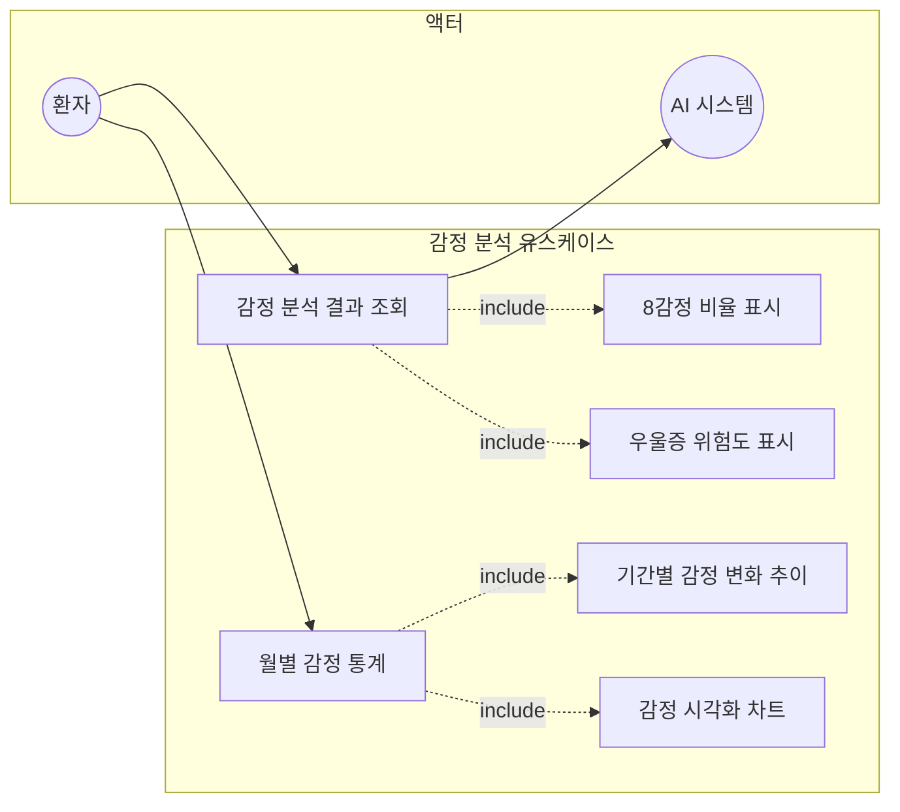

#### 유스케이스 명세: 감정 분석 결과 조회 (UC-ANL-001)

| 항목 | 내용 |
|------|------|
| **유스케이스 ID** | UC-ANL-001 |
| **유스케이스명** | 감정 분석 결과 조회 |
| **액터** | 환자 (User), AI 시스템 |
| **관련 화면** | SCR-MEM-003 (일기 상세 모달) |
| **관련 요구사항** | A-01, A-02, A-03 |
| **관련 테스트케이스** | TC-ANL-001 ~ TC-ANL-012 |
| **사전조건** | - 로그인 상태<br>- 일기 작성 및 감정 분석 완료 |
| **사후조건** | - 감정 분석 결과 표시 |
| **기본 흐름** | 1. 사용자가 일기 상세를 조회한다<br>2. 시스템이 tb_analysis에서 해당 일기의 분석 결과를 조회한다<br>3. 시스템이 9가지 감정 비율을 표시한다 (기쁨, 희망, 중립, 분노, 슬픔, 불안, 피로, 후회, 우울)<br>5. 시스템이 감정별 컬러 배지를 표시한다 |
| **대안 흐름** | 2a. 분석 결과가 없는 경우 (AI 서버 장애 등)<br>&nbsp;&nbsp;&nbsp;-> "분석 결과 없음" 메시지 표시 |
| **예외 흐름** | - 서버 오류 시 오류 메시지 표시 |

#### 유스케이스 명세: 월별 감정 통계 (UC-ANL-002)

| 항목 | 내용 |
|------|------|
| **유스케이스 ID** | UC-ANL-002 |
| **유스케이스명** | 월별 감정 통계 |
| **액터** | 환자 (User) |
| **관련 화면** | SCR-MEM-003 |
| **관련 요구사항** | A-04 |
| **관련 테스트케이스** | TC-ANL-001 ~ TC-ANL-012 |
| **사전조건** | - 로그인 상태<br>- 분석 데이터 존재 |
| **사후조건** | - 기간별 감정 변화 통계 표시 |
| **기본 흐름** | 1. 사용자가 일기 목록에서 기간 필터를 설정한다<br>2. 시스템이 해당 기간의 분석 데이터를 집계한다<br>3. 시스템이 감정 변화 추이를 시각화하여 표시한다<br>4. 시스템이 감정별 색상 배지로 요약 정보를 표시한다 |
| **대안 흐름** | 2a. 해당 기간에 데이터가 없는 경우<br>&nbsp;&nbsp;&nbsp;-> "해당 기간 데이터 없음" 메시지 표시 |

---

### 3.4 의사 시스템

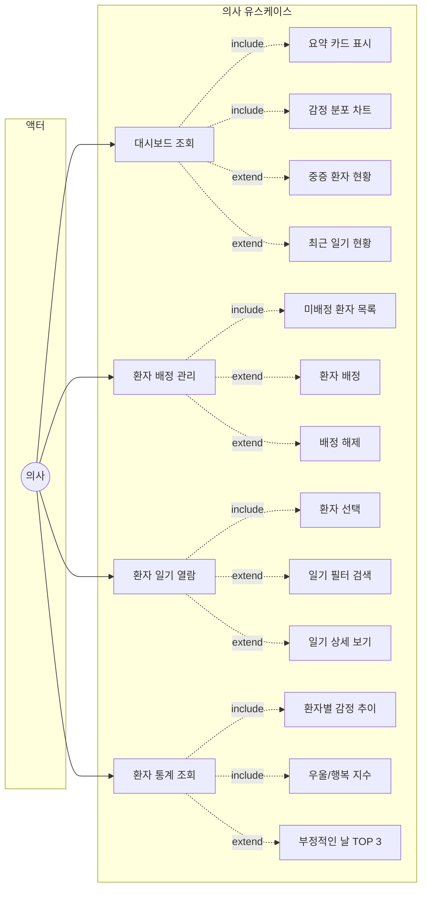

#### 유스케이스 명세: 대시보드 조회 (UC-DOC-001)

| 항목 | 내용 |
|------|------|
| **유스케이스 ID** | UC-DOC-001 |
| **유스케이스명** | 대시보드 조회 |
| **액터** | 의사 (Doctor) |
| **관련 화면** | SCR-DOC-002 |
| **관련 요구사항** | H-02 |
| **관련 테스트케이스** | TC-DSH-001 ~ TC-DSH-012 |
| **사전조건** | - DOCTOR 권한으로 로그인 상태 |
| **사후조건** | - 대시보드 현황 표시 |
| **기본 흐름** | 1. 의사가 대시보드 페이지(`/doctor/dashboard`)에 접근한다<br>2. 시스템이 `/api/analyses/dashboard/{doctId}` API를 호출한다<br>3. 시스템이 요약 카드 4개를 표시한다 (배정환자, 중증환자, 이번달 일기, 평균 행복지수)<br>4. 시스템이 전체 환자 감정 분포 파이 차트를 표시한다<br>5. 시스템이 최근 7일 일기 작성 추이 라인 차트를 표시한다<br>6. 시스템이 중증 환자 현황 목록을 표시한다 (환자명, 우울지수)<br>7. 시스템이 최근 일기 작성 현황을 표시한다<br>8. 시스템이 월별 감정 추이 막대 차트를 표시한다 |
| **대안 흐름** | 2a. 배정된 환자가 없는 경우<br>&nbsp;&nbsp;&nbsp;-> 빈 상태 메시지 표시 (에러 아님) |
| **예외 흐름** | - USER 권한으로 접근 시 403 Forbidden 또는 리다이렉트 |

#### 유스케이스 명세: 환자 배정 관리 (UC-DOC-002)

| 항목 | 내용 |
|------|------|
| **유스케이스 ID** | UC-DOC-002 |
| **유스케이스명** | 환자 배정 관리 |
| **액터** | 의사 (Doctor) |
| **관련 화면** | SCR-DOC-005 (환자 배정 탭) |
| **관련 요구사항** | H-03 |
| **관련 테스트케이스** | TC-ARR-001 ~ TC-ARR-005 |
| **사전조건** | - DOCTOR 권한으로 로그인 상태 |
| **사후조건** | - 환자 배정/해제 결과 tb_arrange에 반영 |
| **기본 흐름** | 1. 의사가 마이페이지의 환자 배정 탭에 접근한다<br>2. 시스템이 현재 배정된 환자 목록을 표시한다<br>3. 시스템이 미배정 환자 목록을 표시한다<br>4. 의사가 미배정 환자를 선택하고 "배정하기" 버튼을 클릭한다<br>5. 시스템이 tb_arrange에 배정 레코드를 생성한다<br>6. 시스템이 배정 완료 메시지를 표시한다 |
| **대안 흐름** | 4a. 의사가 기존 배정 환자를 해제하는 경우<br>&nbsp;&nbsp;&nbsp;-> tb_arrange 레코드 삭제<br>3a. 미배정 환자가 없는 경우<br>&nbsp;&nbsp;&nbsp;-> 빈 목록 표시 |
| **예외 흐름** | - 서버 오류 시 오류 메시지 표시 |

#### 유스케이스 명세: 환자 일기 열람 (UC-DOC-003)

| 항목 | 내용 |
|------|------|
| **유스케이스 ID** | UC-DOC-003 |
| **유스케이스명** | 환자 일기 열람 |
| **액터** | 의사 (Doctor) |
| **관련 화면** | SCR-DOC-004 |
| **관련 요구사항** | D-02, D-03 |
| **관련 테스트케이스** | TC-PDL-001 ~ TC-PDL-006 |
| **사전조건** | - DOCTOR 권한으로 로그인 상태<br>- 환자가 배정되어 있음 |
| **사후조건** | - 환자 일기 및 분석 결과 표시 |
| **기본 흐름** | 1. 의사가 환자 일기 목록 페이지(`/doctor/patient-diary-list`)에 접근한다<br>2. 시스템이 배정 환자 드롭다운을 표시한다<br>3. 의사가 환자를 선택한다<br>4. 시스템이 해당 환자의 일기 카드 목록을 표시한다<br>5. 의사가 날짜/키워드로 필터 검색한다 (선택사항)<br>6. 의사가 일기 카드를 클릭한다<br>7. 시스템이 일기 상세 모달을 표시한다 (내용 + 감정 분석 결과 포함) |
| **대안 흐름** | 4a. 해당 환자의 일기가 없는 경우<br>&nbsp;&nbsp;&nbsp;-> 빈 상태 메시지 표시<br>5a. 검색 결과가 없는 경우<br>&nbsp;&nbsp;&nbsp;-> "검색 결과 없음" 메시지 표시 |
| **예외 흐름** | - 담당 환자가 아닌 경우 데이터 미반환 |

#### 유스케이스 명세: 환자 통계 조회 (UC-DOC-004)

| 항목 | 내용 |
|------|------|
| **유스케이스 ID** | UC-DOC-004 |
| **유스케이스명** | 환자 통계 조회 |
| **액터** | 의사 (Doctor) |
| **관련 화면** | SCR-DOC-003 |
| **관련 요구사항** | A-04 |
| **관련 테스트케이스** | TC-PST-001 ~ TC-PST-009 |
| **사전조건** | - DOCTOR 권한으로 로그인 상태<br>- 환자가 배정되어 있음<br>- 환자의 분석 데이터 존재 |
| **사후조건** | - 환자별 감정 통계 표시 |
| **기본 흐름** | 1. 의사가 환자 통계 페이지(`/doctor/patient-stats`)에 접근한다<br>2. 시스템이 배정 환자 드롭다운을 표시한다<br>3. 의사가 환자를 선택하고 연/월을 설정한다<br>4. 시스템이 `GET /api/analyses/stats/{memberId}?year={year}&month={month}` API를 호출한다<br>5. 시스템이 종합 우울지수와 행복지수를 표시한다 (보통/주의/위험 레이블)<br>6. 시스템이 가장 부정적이었던 날 TOP 3을 표시한다<br>7. 시스템이 종합 마음 추이 차트 (일별 감정 변화 시계열)를 표시한다<br>8. 시스템이 행복/우울 지수 변화 이중 축 비교 차트를 표시한다 |
| **대안 흐름** | 4a. 해당 기간에 데이터가 없는 경우<br>&nbsp;&nbsp;&nbsp;-> "데이터 없음" 메시지 표시 |
| **예외 흐름** | - 서버 오류 시 오류 메시지 표시 |

---

### 3.5 병원 관리 시스템

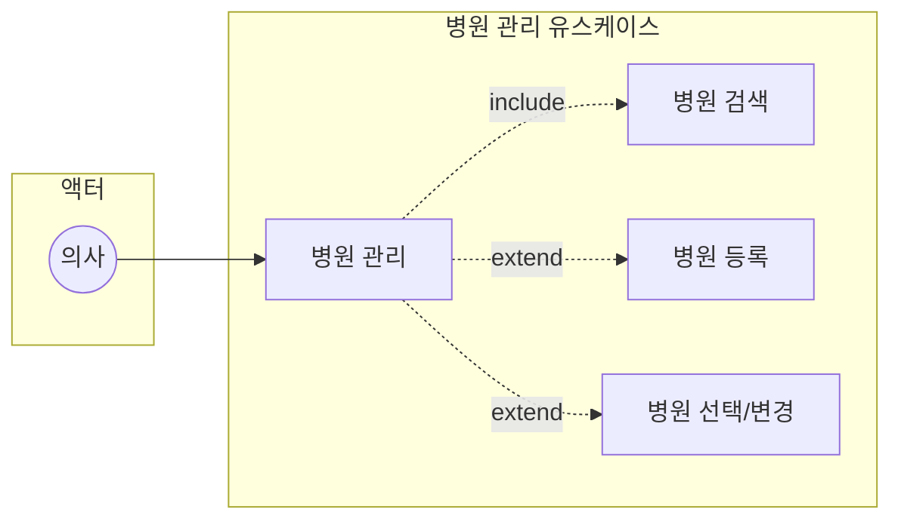

#### 유스케이스 명세: 병원 관리 (UC-HSP-001)

| 항목 | 내용 |
|------|------|
| **유스케이스 ID** | UC-HSP-001 |
| **유스케이스명** | 병원 관리 |
| **액터** | 의사 (Doctor) |
| **관련 화면** | SCR-HSP-001, SCR-HSP-002, SCR-DOC-005 |
| **관련 요구사항** | H-01 |
| **관련 테스트케이스** | TC-HSP-001 ~ TC-HSP-005 |
| **사전조건** | - DOCTOR 권한으로 로그인 상태 |
| **사후조건** | - 병원 정보 저장/변경 반영 |
| **기본 흐름** | 1. 의사가 마이페이지에서 "병원 선택" 버튼을 클릭한다<br>2. 시스템이 병원 검색 팝업(`/hospital/searchPopup`)을 표시한다<br>3. 의사가 병원명을 입력하고 검색한다<br>4. 시스템이 매칭되는 병원 목록을 표시한다<br>5. 의사가 병원을 선택한다<br>6. 시스템이 선택된 병원 정보를 tb_doctor에 반영한다 |
| **대안 흐름** | 3a. 원하는 병원이 없는 경우<br>&nbsp;&nbsp;&nbsp;-> "병원 추가" 버튼 클릭 -> 병원 등록 폼(`/hospital/addForm`) 표시<br>&nbsp;&nbsp;&nbsp;-> 병원명, 주소, 전화번호 입력 후 등록 -> tb_hospital에 저장 |
| **예외 흐름** | - 서버 오류 시 오류 메시지 표시 |

---

### 3.6 AI 챗봇 시스템

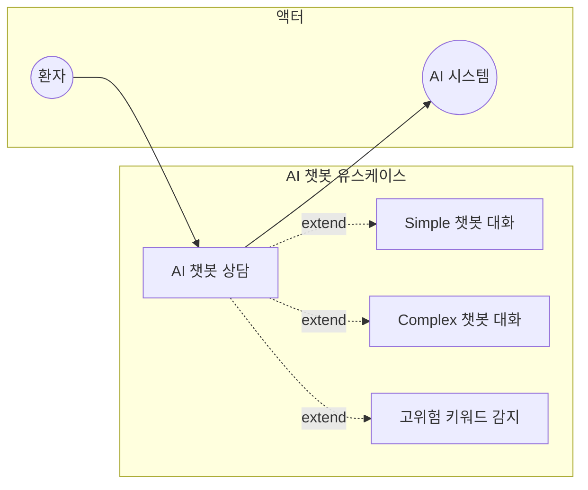

#### 유스케이스 명세: AI 챗봇 상담 (UC-CHT-001)

| 항목 | 내용 |
|------|------|
| **유스케이스 ID** | UC-CHT-001 |
| **유스케이스명** | AI 챗봇 상담 |
| **액터** | 환자 (User), AI 시스템 |
| **관련 화면** | SCR-MEM-002 (챗봇 영역) |
| **관련 요구사항** | C-01, C-02 |
| **관련 테스트케이스** | TC-CHT-001 ~ TC-CHT-010 |
| **사전조건** | - USER 권한으로 로그인 상태<br>- FastAPI AI 서버 실행 중 |
| **사후조건** | - 대화 내역 화면 표시 |
| **기본 흐름** | 1. 사용자가 챗봇 화면에 접근한다<br>2. 시스템이 챗봇 인터페이스를 표시한다<br>3. 사용자가 메시지를 입력한다<br>4. 사용자가 전송 버튼을 클릭한다<br>5. 시스템이 FastAPI 챗봇 API를 호출한다<br>&nbsp;&nbsp;&nbsp;- Simple: `GET /chatbot/g?s=메시지` (KoGPT2)<br>&nbsp;&nbsp;&nbsp;- Complex: `GET /chatbot/b?s=메시지` (KoBERT)<br>6. AI 시스템이 공감 응답을 생성한다<br>7. 시스템이 챗봇 응답을 화면에 표시한다<br>8. 3~7단계를 반복한다 |
| **대안 흐름** | 3a. 빈 메시지 전송 시<br>&nbsp;&nbsp;&nbsp;-> "듣고 있어요. 더 말씀해주세요~" 기본 응답<br>6a. 우울/고위험 키워드 감지 시<br>&nbsp;&nbsp;&nbsp;-> 전문 상담 연결 안내 메시지 추가 표시 |
| **예외 흐름** | - AI 서버 연결 실패 시 에러 메시지 또는 기본 응답 표시 |

---

### 3.7 음악 추천 시스템

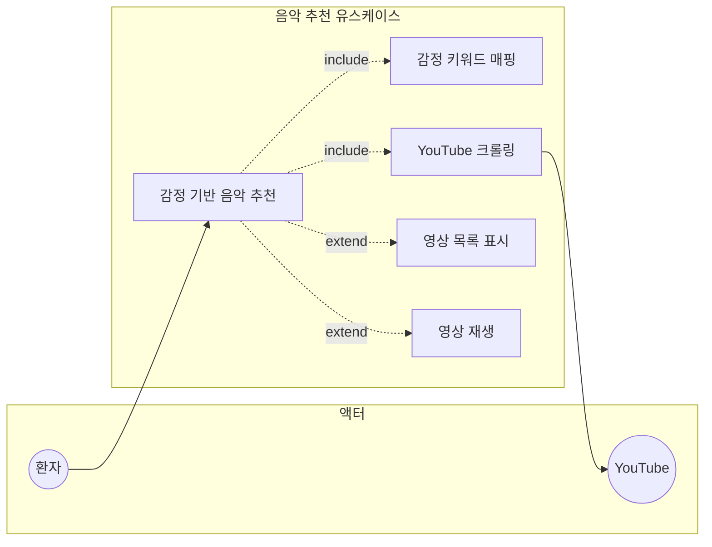

#### 유스케이스 명세: 감정 기반 음악 추천 (UC-MSC-001)

| 항목 | 내용 |
|------|------|
| **유스케이스 ID** | UC-MSC-001 |
| **유스케이스명** | 감정 기반 음악 추천 |
| **액터** | 환자 (User), YouTube |
| **관련 화면** | SCR-MEM-002 |
| **관련 요구사항** | Y-01, Y-02 |
| **관련 테스트케이스** | TC-MUS-001 ~ TC-MUS-008 |
| **사전조건** | - USER 권한으로 로그인 상태<br>- 감정 분석 완료 또는 감정 칩 선택 |
| **사후조건** | - YouTube 추천 음악 목록 표시 |
| **기본 흐름** | 1. 사용자가 일기 작성 페이지에서 "기분에 따른 추천 영상 목록보기" 버튼을 클릭한다<br>2. 시스템이 분석된 주요 감정을 식별한다<br>3. 시스템이 감정에 맞는 검색어를 결정한다 (예: 기쁨 -> "기쁠때 듣는 노래")<br>4. 시스템이 FastAPI 음악 검색 API(`POST /youtube/search`)를 호출한다<br>5. AI 서버가 Selenium으로 YouTube를 크롤링하여 영상 목록을 반환한다<br>6. 시스템이 추천 영상 목록을 표시한다 (제목, 썸네일, 채널명, 조회수)<br>7. 사용자가 원하는 영상을 선택한다<br>8. 시스템이 해당 YouTube 영상을 재생한다 |
| **대안 흐름** | 5a. 검색 결과가 없는 경우<br>&nbsp;&nbsp;&nbsp;-> 빈 목록 표시 |
| **예외 흐름** | - YouTube 크롤링 실패 시 에러 메시지 표시<br>- 응답 시간 10초 초과 시 타임아웃 안내 |

---

### 3.8 사용자 관리 시스템

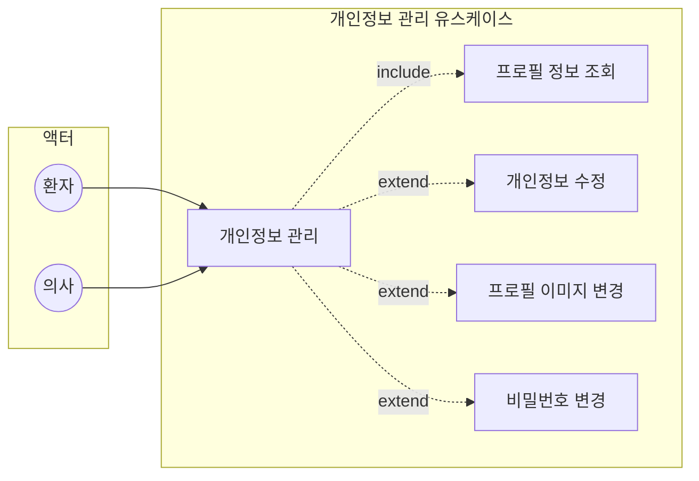

#### 유스케이스 명세: 개인정보 관리 (UC-USR-001)

| 항목 | 내용 |
|------|------|
| **유스케이스 ID** | UC-USR-001 |
| **유스케이스명** | 개인정보 관리 |
| **액터** | 환자 (User), 의사 (Doctor) |
| **관련 화면** | SCR-MEM-004, SCR-DOC-005 |
| **관련 요구사항** | M-04, M-05 |
| **관련 테스트케이스** | TC-MYP-001 ~ TC-MYP-010, TC-DMP-001 ~ TC-DMP-007 |
| **사전조건** | - 로그인 상태 |
| **사후조건** | - 변경된 회원 정보 tb_member에 반영 |
| **기본 흐름** | 1. 사용자가 마이페이지에 접근한다<br>&nbsp;&nbsp;&nbsp;- USER: `/member/mypage`<br>&nbsp;&nbsp;&nbsp;- DOCTOR: `/doctor/mypage`<br>2. 시스템이 현재 프로필 정보를 표시한다 (아이디/역할은 읽기전용)<br>3. 사용자가 수정할 항목을 변경한다 (이름, 비밀번호, 전화번호, 이메일, 주소)<br>4. 사용자가 프로필 이미지를 변경한다 (선택사항)<br>5. 사용자가 "회원 정보 수정" 버튼을 클릭한다<br>6. 시스템이 입력값을 검증한다<br>7. 시스템이 회원 정보를 업데이트한다 (비밀번호 변경 시 BCrypt 재암호화) |
| **대안 흐름** | 6a. 이메일 중복 시<br>&nbsp;&nbsp;&nbsp;-> "이미 사용 중인 이메일" 메시지 표시<br>DOCTOR의 경우 추가 흐름:<br>&nbsp;&nbsp;&nbsp;-> 소속 병원 선택/변경 (UC-HSP-001 연계)<br>&nbsp;&nbsp;&nbsp;-> 전문 분야 수정<br>&nbsp;&nbsp;&nbsp;-> 환자 배정 관리 (UC-DOC-002 연계) |
| **예외 흐름** | - 서버 오류 시 오류 메시지 표시 |

---

## 4. 유스케이스 매트릭스

### 4.1 액터별 유스케이스 매핑

| 유스케이스 | Guest | User | Doctor | AI 시스템 | YouTube |
|-----------|:-----:|:----:|:------:|:---------:|:-------:|
| 회원가입 | O | - | - | - | - |
| 로그인 | O | - | - | - | - |
| 로그아웃 | - | O | O | - | - |
| 비밀번호 재설정 | O | - | - | - | - |
| 일기 작성 | - | O | - | O | - |
| 일기 관리 | - | O | - | - | - |
| 감정 분석 결과 조회 | - | O | - | O | - |
| 월별 감정 통계 | - | O | - | - | - |
| AI 챗봇 상담 | - | O | - | O | - |
| 감정 기반 음악 추천 | - | O | - | - | O |
| 개인정보 관리 | - | O | O | - | - |
| 대시보드 조회 | - | - | O | - | - |
| 환자 배정 관리 | - | - | O | - | - |
| 환자 일기 열람 | - | - | O | - | - |
| 환자 통계 조회 | - | - | O | - | - |
| 병원 관리 | - | - | O | - | - |

### 4.2 유스케이스-요구사항-화면-테스트케이스 추적표

| 유스케이스 ID | 유스케이스명 | 관련 요구사항 | 관련 화면 | 관련 테스트케이스 |
|--------------|-------------|--------------|----------|------------------|
| UC-AUTH-001 | 회원가입 | M-01 | SCR-PUB-003 | TC-SGN-* |
| UC-AUTH-002 | 로그인 | M-02 | SCR-PUB-002 | TC-LGN-* |
| UC-AUTH-003 | 로그아웃 | M-03 | 공통 (사이드바) | TC-LGN-009 |
| UC-AUTH-004 | 비밀번호 재설정 | M-04 | SCR-PUB-002 | TC-PWD-* |
| UC-DIARY-001 | 일기 작성 | D-01, A-01, A-02, A-03 | SCR-MEM-002 | TC-DRW-*, TC-ANL-* |
| UC-DIARY-002 | 일기 관리 | D-02, D-03, D-04, D-05 | SCR-MEM-003 | TC-DRL-* |
| UC-ANL-001 | 감정 분석 결과 조회 | A-01, A-02, A-03 | SCR-MEM-003 (모달) | TC-ANL-* |
| UC-ANL-002 | 월별 감정 통계 | A-04 | SCR-MEM-003 | TC-ANL-* |
| UC-DOC-001 | 대시보드 조회 | H-02 | SCR-DOC-002 | TC-DSH-* |
| UC-DOC-002 | 환자 배정 관리 | H-03 | SCR-DOC-005 | TC-ARR-* |
| UC-DOC-003 | 환자 일기 열람 | D-02, D-03 | SCR-DOC-004 | TC-PDL-* |
| UC-DOC-004 | 환자 통계 조회 | A-04 | SCR-DOC-003 | TC-PST-* |
| UC-HSP-001 | 병원 관리 | H-01 | SCR-HSP-001, SCR-HSP-002 | TC-HSP-* |
| UC-CHT-001 | AI 챗봇 상담 | C-01, C-02 | SCR-MEM-002 | TC-CHT-* |
| UC-MSC-001 | 감정 기반 음악 추천 | Y-01, Y-02 | SCR-MEM-002 | TC-MUS-* |
| UC-USR-001 | 개인정보 관리 | M-04, M-05 | SCR-MEM-004, SCR-DOC-005 | TC-MYP-*, TC-DMP-* |

---

## 5. 시퀀스 다이어그램

### 5.1 로그인 시퀀스

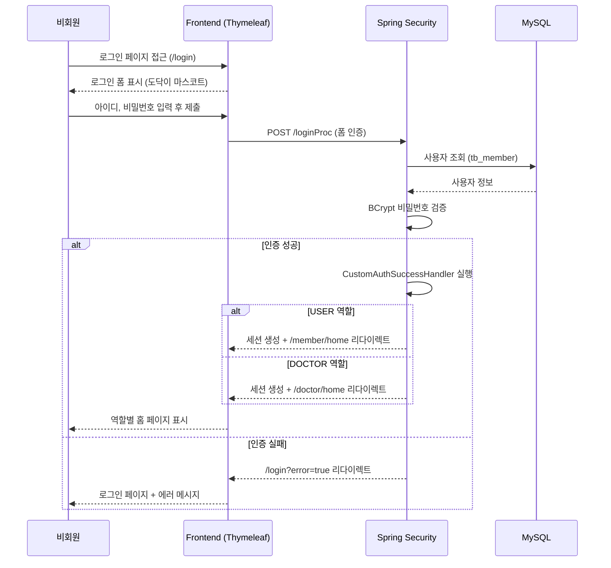

### 5.2 일기 작성 + 감정 분석 시퀀스

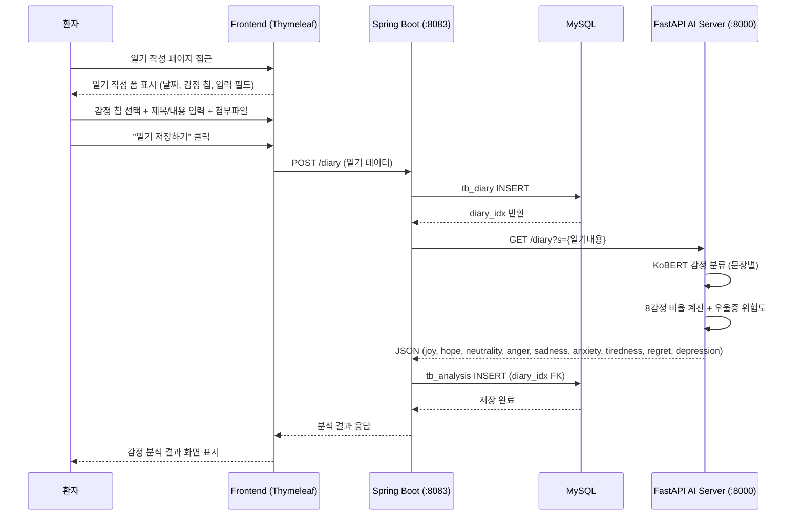

### 5.3 AI 챗봇 상담 시퀀스

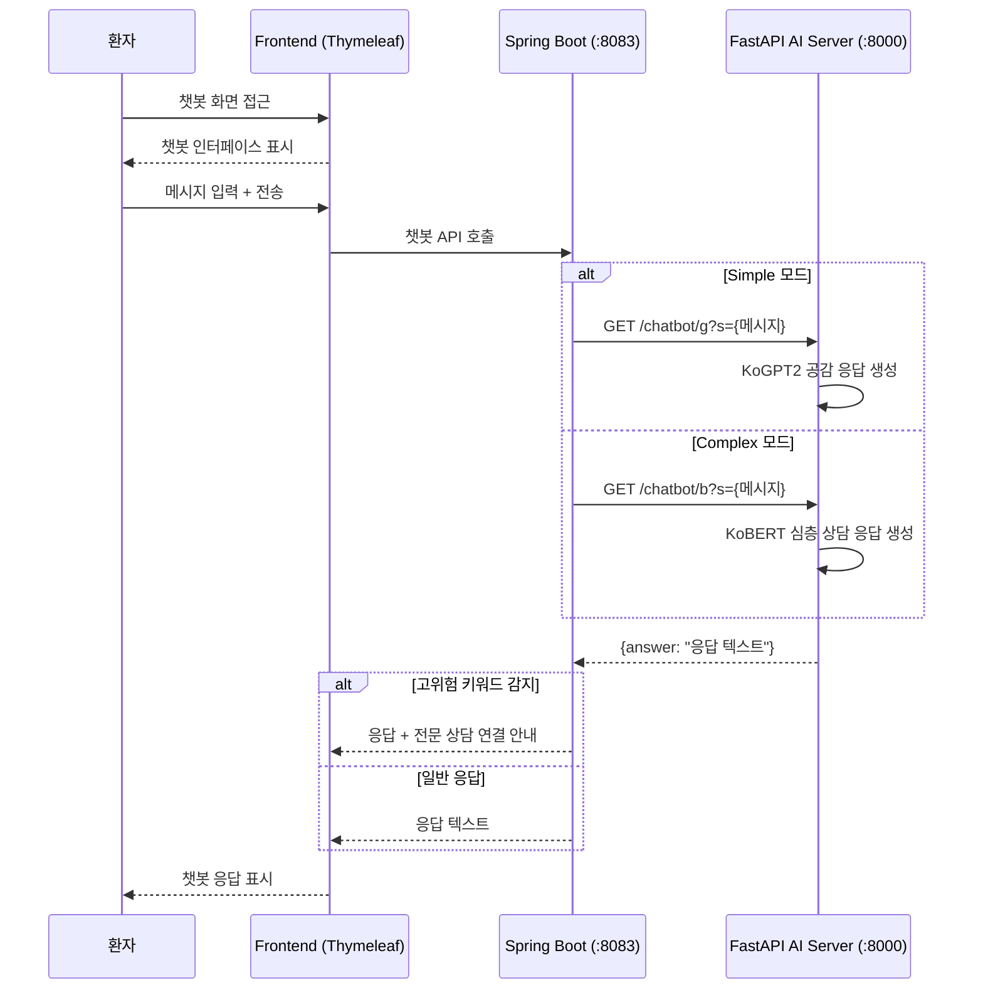

### 5.4 감정 기반 음악 추천 시퀀스

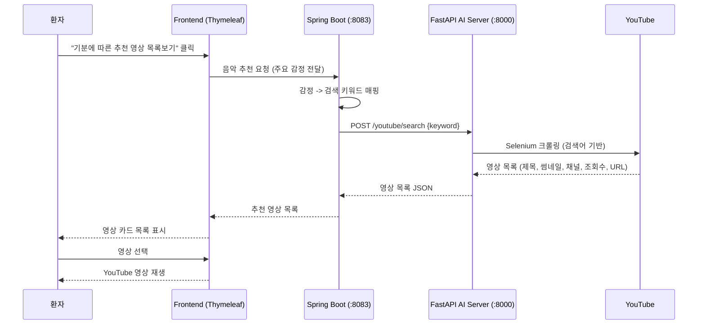

### 5.5 의사 대시보드 조회 시퀀스

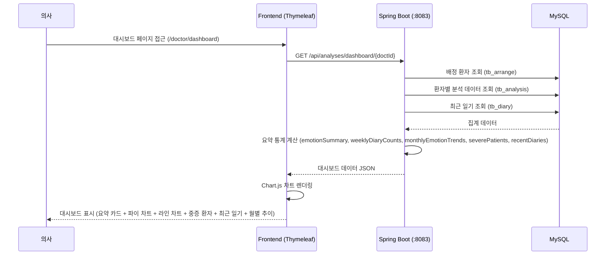

---

## 6. 유스케이스 관계

### 6.1 Include 관계

| 기본 UC | 포함 UC | 설명 |
|---------|---------|------|
| UC-DIARY-001 일기 작성 | UC-ANL-001 감정 분석 | 일기 저장 시 자동으로 AI 감정 분석 실행 |

### 6.2 Extend 관계

| 기본 UC | 확장 UC | 조건 |
|---------|---------|------|
| UC-DIARY-001 일기 작성 | UC-MSC-001 음악 추천 | 사용자가 추천 영상 버튼 클릭 시 |
| UC-CHT-001 챗봇 상담 | 전문 상담 안내 | 고위험 우울 키워드 감지 시 |
| UC-USR-001 개인정보 관리 | UC-DOC-002 환자 배정 | DOCTOR 역할의 마이페이지에서 |
| UC-USR-001 개인정보 관리 | UC-HSP-001 병원 관리 | DOCTOR 역할의 병원 선택/추가 시 |

---

## 7. 관련 문서

| 문서 | 설명 |
|------|------|
| [REQUIREMENTS.md](./REQUIREMENTS.md) | 요구사항 정의서 |
| [FUNCTIONAL_SPECIFICATION.md](./FUNCTIONAL_SPECIFICATION.md) | 기능 명세서 |
| [SCREEN_DESIGN.md](./SCREEN_DESIGN.md) | 화면 설계서 |
| [TEST_CASES.md](./TEST_CASES.md) | 테스트 케이스 |
| [API_SPECIFICATION.md](./API_SPECIFICATION.md) | API 명세서 |

---

## 문서 이력

| 버전 | 변경일 | 변경자 | 변경 내용 |
|------|--------|--------|----------|
| 1.0 | 2026-02-03 | 최대영 | 최초 작성 |
| 1.1 | 2026-02-09 | 박제연 | 의사 유스케이스(UC-DOC-*) 추가, 액터 계층 수정 (Guest->User/Doctor extends), 실제 구현 기반 최신화, mermaid 다이어그램 추가, UC 명세 테이블 상세화, 시퀀스 다이어그램 추가 |
